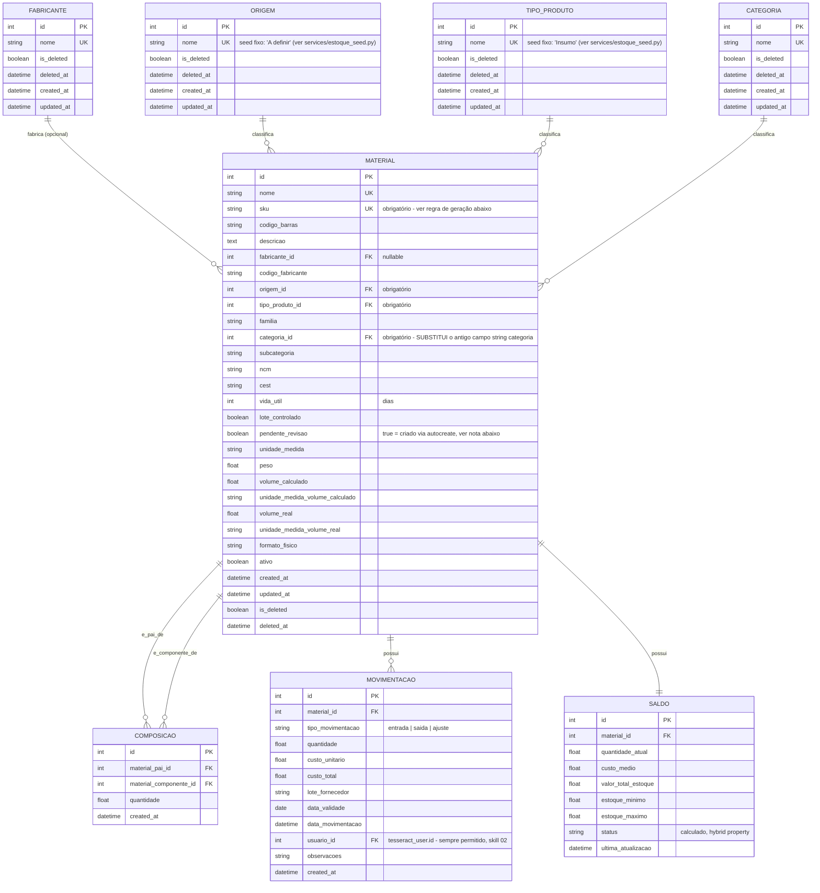

# 04 — Modelo de Dados (Addon Estoque)

> **Atualizado nesta sessão** (ampliação de `Material` — ver
> `BACKLOG.md`): campos fiscais/de rastreio novos, substituição de
> `categoria` (string livre) por FK, e 4 tabelas de lookup novas
> (`Fabricante`/`Origem`/`TipoProduto`/`Categoria`). O restante do
> diagrama (Composicao/Movimentacao/Saldo) não mudou.
>
> **Nota de divergência encontrada ao revisar o código real**: esta
> versão anterior do documento descrevia `Material.external_id` (UUID,
> regra de PK externa da skill 02) — esse campo **não existe** no
> model real (`addons/addon_estoque/root/model/material.py`) e nunca
> existiu. Removido do diagrama abaixo para refletir o código real.
> Se `Material` precisar de identificador estável exposto
> externamente no futuro, aplicar a regra da skill 02 então — não é
> necessário hoje, `id`/`sku` já resolvem os casos de uso atuais.

```mermaid
erDiagram
    FABRICANTE ||--o{ MATERIAL : "fabrica (opcional)"
    ORIGEM ||--o{ MATERIAL : "classifica"
    TIPO_PRODUTO ||--o{ MATERIAL : "classifica"
    CATEGORIA ||--o{ MATERIAL : "classifica"
    MATERIAL ||--o{ COMPOSICAO : "e_pai_de"
    MATERIAL ||--o{ COMPOSICAO : "e_componente_de"
    MATERIAL ||--o{ MOVIMENTACAO : "possui"
    MATERIAL ||--|| SALDO : "possui"

    FABRICANTE {
        int id PK
        string nome UK
        boolean is_deleted
        datetime deleted_at
        datetime created_at
        datetime updated_at
    }
    ORIGEM {
        int id PK
        string nome UK "seed fixo: 'A definir' (ver services/estoque_seed.py)"
        boolean is_deleted
        datetime deleted_at
        datetime created_at
        datetime updated_at
    }
    TIPO_PRODUTO {
        int id PK
        string nome UK "seed fixo: 'Insumo' (ver services/estoque_seed.py)"
        boolean is_deleted
        datetime deleted_at
        datetime created_at
        datetime updated_at
    }
    CATEGORIA {
        int id PK
        string nome UK
        boolean is_deleted
        datetime deleted_at
        datetime created_at
        datetime updated_at
    }
    MATERIAL {
        int id PK
        string nome UK
        string sku UK "obrigatório - ver regra de geração abaixo"
        string codigo_barras
        text descricao
        int fabricante_id FK "nullable"
        string codigo_fabricante
        int origem_id FK "obrigatório"
        int tipo_produto_id FK "obrigatório"
        string familia
        int categoria_id FK "obrigatório - SUBSTITUI o antigo campo string categoria"
        string subcategoria
        string ncm
        string cest
        int vida_util "dias"
        boolean lote_controlado
        boolean pendente_revisao "true = criado via autocreate, ver nota abaixo"
        string unidade_medida
        float peso
        float volume_calculado
        string unidade_medida_volume_calculado
        float volume_real
        string unidade_medida_volume_real
        string formato_fisico
        boolean ativo
        datetime created_at
        datetime updated_at
        boolean is_deleted
        datetime deleted_at
    }
    COMPOSICAO {
        int id PK
        int material_pai_id FK
        int material_componente_id FK
        float quantidade
        datetime created_at
    }
    MOVIMENTACAO {
        int id PK
        int material_id FK
        string tipo_movimentacao "entrada | saida | ajuste"
        float quantidade
        float custo_unitario
        float custo_total
        string lote_fornecedor
        date data_validade
        datetime data_movimentacao
        int usuario_id FK "tesseract_user.id - sempre permitido, skill 02"
        string observacoes
        datetime created_at
    }
    SALDO {
        int id PK
        int material_id FK
        float quantidade_atual
        float custo_medio
        float valor_total_estoque
        float estoque_minimo
        float estoque_maximo
        string status "calculado, hybrid property"
        datetime ultima_atualizacao
    }
```

## Tabelas — nome completo e descrição de negócio

| Tabela real | Descrição |
|---|---|
| `tesseract_estoque_fabricante` | Lookup simples (fabricante/marca). Referenciado opcionalmente por `Material.fabricante_id`. |
| `tesseract_estoque_origem` | Lookup simples (nacional/importado/etc.). Ganha o registro seed `"A definir"` no boot (`ensure_default_estoque_lookups`, chamado em `core/app_factory.py`) — usado quando a origem real não é conhecida (ex.: autocreate do BrewFather). |
| `tesseract_estoque_tipo_produto` | Lookup simples (classificação de Material). Ganha o registro seed `"Insumo"` no boot — usado quando o Material vem de um fluxo que sabe que é insumo de receita, mesmo sem classificação detalhada. |
| `tesseract_estoque_categoria` | Lookup simples. **Substitui** o antigo campo `Material.categoria` (string livre, ex.: `materia_prima`/`embalagem`/`kit`/`outro`) — mesmos valores, agora como registro de tabela em vez de string solta. |
| `tesseract_estoque_material` | Identidade de qualquer coisa estocável. `sku` é o identificador de negócio (único, sempre presente — gerado automaticamente em fluxos automáticos, editável depois). `origem_id`/`tipo_produto_id`/`categoria_id` são obrigatórios; `fabricante_id` é opcional. `volume_calculado` = teórico; `volume_real` = medido/declarado — podem divergir, campos e unidades separadas. |
| `tesseract_estoque_composicao` | Auto-relacionamento (BOM). FK real, mesmo Addon (skill 02). |
| `tesseract_estoque_movimentacao` | Ledger imutável — correção é lançamento de ajuste, nunca update/delete. |
| `tesseract_estoque_saldo` | Cache materializado 1:1 com `material`. |

### Sobre `Material.pendente_revisao` e a resolução de campos obrigatórios no autocreate

`origem_id`/`tipo_produto_id`/`categoria_id`/`sku` são obrigatórios em
`Material`, mas o autocreate de ingredientes vindo do BrewFather
(`addons/addon_brewstation/features/feature_brew_father/services/ingredient_autocreate_service.py`)
não recebe essa informação da API externa. Resolvido assim:

- `tipo_produto_id` → sempre o seed `"Insumo"` — não é um
  "desconhecido" temporário, é uma classificação correta de fato para
  tudo que vem de sync de receita.
- `origem_id` → sempre o seed `"A definir"` — esse sim é desconhecido
  de verdade (BrewFather não informa nacional/importado).
- `categoria_id` → `get_or_create` por nome, reaproveitando o mesmo
  mapeamento `tipo_ingrediente → categoria` que já existia para o
  antigo campo string.
- `sku` → `"{TIPO_INGREDIENTE}-{10 primeiros caracteres do nome}"`,
  maiúsculo, sem acento (ex.: `MALTE-PILSEN`), com sufixo numérico
  sequencial em caso de colisão. `{TIPO_INGREDIENTE}` vem do tipo já
  existente em `feature_ingredientes` (`MALTE`/`LUPULO`/`LEVEDURA`),
  não de `tipo_produto_id` (que é sempre `"Insumo"` genérico).
- `pendente_revisao=True` é setado nesse fluxo — **só sinaliza** (filtro
  na tela de-para de `feature_brew_father`), nunca bloqueia
  `Movimentacao`/`Saldo` (decisão explícita — o registro é editável
  depois pelo usuário, e a operação de estoque não deve esperar essa
  revisão).

**Soft-delete**: **correção pós-bug real** — as tabelas têm
`is_deleted`/`deleted_at`, seguindo a skill 02 ("padrão para qualquer
entidade gerada pelo CrudGen"). A intenção original era `movimentacao`
não ter soft-delete (é ledger contábil, correção é sempre novo
lançamento de ajuste, nunca edição) — mas isso divergia da skill sem
ter sido sinalizado como exceção, e quebrou a tela de listagem gerada
(CrudGen filtra por `is_deleted` incondicionalmente em toda entidade).
A trash/restore gerada fica disponível na UI para `movimentacao`, mas
o uso pretendido continua sendo só ocultar um lançamento claramente
errado da listagem — nunca "consertar" um valor (isso é sempre um novo
lançamento).

## Referenciado (fracamente) por outros Addons

| Addon/Feature consumidor | Coluna | Resolvido por |
|---|---|---|
| `addon_brewstation` / `feature_mash_control` (`RecipeIngredient`, `IngredientMapping`) | `material_id` | `material_lookup` |
| `addon_brewstation` / `feature_ingredientes` (Malte/Lupulo/Levedura) | `material_id` | `material_lookup` |
| `addon_brewstation` / `feature_envase` (`ItemEnvase`) | `material_id` | `material_lookup` |

Ver `addons/addon_brewstation/docs/technical/04-modelo-de-dados.md` e
`addons/addon_brewstation/features/feature_mash_control/docs/technical/04-modelo-de-dados.md`
para o lado espelhado.
