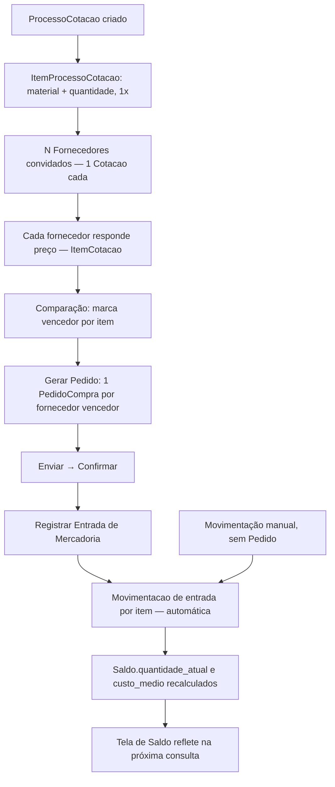

# 05 — Casos de Uso (Addon Estoque)

## Ator: Usuário (operador de estoque / comprador)

### UC-01 — Cadastrar Material
- **Pré-condição**: permissão `materials.create`; ao menos uma
  `Origem`, `TipoProduto` e `Categoria` já cadastradas
- **Fluxo principal**: acessa Materiais → Novo → preenche nome, sku,
  origem, tipo de produto, categoria (todos obrigatórios), fabricante
  e campos físicos opcionais → salva
- **Fluxo alternativo**: material que é, na prática, kit de outros →
  cadastra normalmente e depois monta a Composição (materiais
  componentes + quantidade) na tela de detalhe
- **Permissão RBAC**: `materials.create`

### UC-02 — Cadastrar unidades de compra/consumo de um Material
- **Pré-condição**: Material já cadastrado; permissão
  `material_unidades.create`
- **Fluxo principal**: na tela de detalhe do Material, seção
  "Unidades", cadastra a unidade-base (`is_unidade_base=true`,
  `fator_para_base=1`) e, se necessário, unidades adicionais de compra
  (ex.: `PCT`, fator `25` quando o pacote deste Material contém 25 KG)
- **Fluxo alternativo**: tentar marcar uma segunda unidade como base →
  rejeitado (índice único parcial); é preciso desmarcar a antiga
  primeiro
- **Permissão RBAC**: `material_unidades.create`

### UC-03 — Registrar Movimentação manual de Estoque
- **Pré-condição**: Material já cadastrado; permissão
  `movimentacaos.create`
- **Fluxo principal**: acessa Movimentações → Nova → escolhe Material,
  tipo (entrada/saída/ajuste), quantidade, custo (se entrada) → salva
  → sistema atualiza Saldo automaticamente (custo médio ponderado)
- **Fluxo alternativo**: quantidade de saída maior que saldo atual →
  sistema alerta, mas não bloqueia (**decisão ainda em aberto**)
- **Permissão RBAC**: `movimentacaos.create`

### UC-04 — Consultar Saldo de Estoque
- **Pré-condição**: permissão `saldos.list`
- **Fluxo principal**: acessa Saldo → filtra por Material/categoria →
  visualiza quantidade_atual, custo_medio, valor_total, status
  (abaixo do mínimo / acima do máximo / normal / sem referência)
- **Permissão RBAC**: `saldos.list`

## Ator: Comprador

### UC-05 — Criar e conduzir um Pedido de Compra até o recebimento
- **Pré-condição**: `Fornecedor` cadastrado; permissão
  `pedido_compras.create`/`pedido_compras.update`
- **Fluxo principal**: cria `PedidoCompra` (fornecedor, transportadora
  opcional) → adiciona `ItemPedidoCompra` (material, unidade de
  compra, quantidade, preço) → "Enviar Pedido" → "Confirmar Pedido" →
  "Registrar Entrada de Mercadoria" (lote/validade opcionais por item)
  → sistema gera `Movimentacao` de entrada por item automaticamente
- **Fluxo alternativo**: cancelar em qualquer etapa antes de
  "Recebido"
- **Fluxo alternativo**: tentar receber sem estar `confirmado` →
  rejeitado (`PedidoCompraStatusInvalidoError`)
- **Permissão RBAC**: `pedido_compras.create`, `pedido_compras.update`
  (usada também para as transições de status — não há permissão de
  aprovação separada, ver `03-fluxos.md`)

### UC-06 — Conduzir um Processo de Cotação (RFQ) até gerar Pedidos
- **Pré-condição**: ao menos 1 `Fornecedor` cadastrado; permissão
  `processo_cotacaos.create`
- **Fluxo principal**: cria `ProcessoCotacao` → adiciona
  `ItemProcessoCotacao` (o item pedido, uma vez) → convida N
  `Fornecedor` (cria uma `Cotacao` por fornecedor) → cada fornecedor
  responde preço por item (`ItemCotacao`) → na aba Comparação, marca o
  vencedor de cada item → "Gerar Pedido" → sistema cria um
  `PedidoCompra` (rascunho) por fornecedor vencedor, com os itens
  certos, prosseguindo a partir daí pelo UC-05
- **Fluxo alternativo**: trocar o vencedor de um item já marcado →
  permitido, desde que o item ainda não tenha sido convertido em
  pedido (`pedido_compra_item_id IS NULL`)
- **Fluxo alternativo**: rodar "Gerar Pedido" de novo no mesmo
  processo → só converte os vencedores ainda não convertidos, nunca
  duplica
- **Permissão RBAC**: `processo_cotacaos.create`, `cotacaos.create`,
  `item_cotacaos.update` (seleção de vencedor)

## Ator: Usuário (ações em massa)

### UC-07 — Aplicar ação a vários Materiais de uma vez
- **Pré-condição**: N Materiais selecionados na lista; permissão
  correspondente à ação escolhida
- **Fluxo principal**: seleciona linhas na lista de Materiais → barra
  de ações aparece → escolhe **Movimentar Estoque** (1 tipo para
  todos, quantidade individual), **Criar Cotação** (processo novo ou
  existente), **Criar Pedido** (pedido novo ou rascunho existente), ou
  **Modificação em Massa** (Fabricante/Origem/Tipo de Produto/
  Categoria/Ativo — só os campos preenchidos são alterados)
- **Fluxo alternativo**: um item falha na ação em massa → os demais
  seguem normalmente (best-effort, não atômico entre itens); retorno
  mostra sucesso/erro por Material
- **Fluxo alternativo**: Modificação em Massa tentando limpar um dos 4
  campos obrigatórios (valor `None`) → rejeitado
- **Permissão RBAC**: `materials.update` (Modificação em Massa),
  `movimentacaos.create` (Movimentar Estoque), `processo_cotacaos.create`/
  `item_processo_cotacaos.create` (Criar Cotação), `pedido_compras.create`/
  `item_pedido_compras.create` (Criar Pedido)

## Ator: Addon externo (via service público)

### UC-08 — Consultar/Buscar Material (leitura programática)
- **Pré-condição**: Addon consumidor declara `"requires": ["estoque"]`
  no próprio manifesto
- **Fluxo principal**: chama `material_lookup.get_material(material_id)`
  ou `material_lookup.buscar_material_por_termo(texto)` → recebe dado
  primitivo (nunca o objeto ORM)
- **Sem tela própria** — interação código-a-código. **Não** tem acesso
  a Fornecedor/PedidoCompra/ProcessoCotacao — esse bloco é interno.

## Diagrama — do Processo de Cotação ao Saldo atualizado (visão ponta a ponta)

