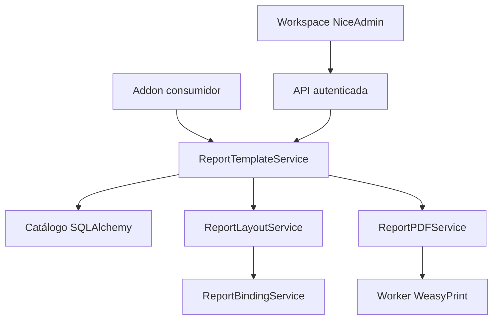

# Componentes do addon

ModuleManager descobre models e blueprints, aplica prefixos, cria tabelas novas segundo o fluxo vigente e sincroniza permissões/transações. Nenhuma alteração do Core foi necessária. Serviço de relatórios não importa ORM de outros addons. Chamadas internas também verificam RBAC; atualmente exigem contexto Flask/Login do servidor.
