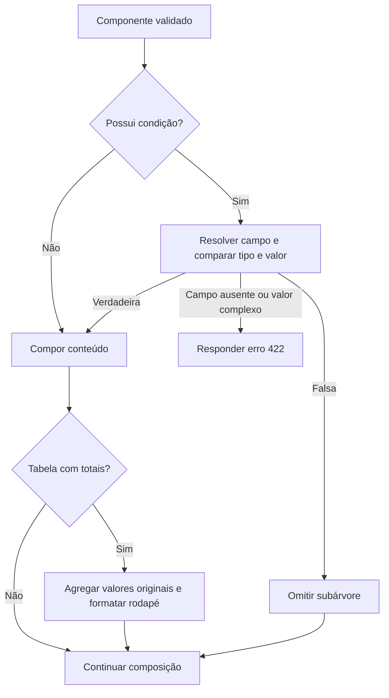

# Fluxos

Publicação compõe HTML do exemplo antes de gravar e confirma por atualização condicional de status/lock_version. Alteração concorrente resulta em 409, preservando a revisão atual. Não chama worker PDF; dados ou vínculos inválidos impedem a publicação.

Emissão: autenticar/autorização render → selecionar revisão publicada explícita ou ativa → validar JSON e parâmetros/defaults → compor HTML escapado → encerrar leitura → text/html, no-store → prévia isolada → impressão pelo navegador. Somente format=pdf inicia subprocesso limitado e retorna application/pdf. Dados inválidos geram JSON 422; capacidade ocupada 429; indisponibilidade/timeout 503. Nunca devolver stack trace ou conteúdo do stderr ao cliente.

Salvamento do rascunho valida estrutura e schema, mas aceita exemplo incompleto: prévia/publicação fazem a validação completa dos dados. Inputs bloqueados durante chamadas da IDE evitam sobrescrever alterações feitas durante a resposta. Conflito mantém a edição local para o usuário revisar.

Na emissão contextual, o documento principal carrega o modal/listener uma vez;
botões vindos de fragmentos AJAX usam delegação. GET /session estabelece token e
cookie antes da consulta do catálogo compatível. O POST envia somente identidade
do material/sessão/planta, template/revisão e parâmetros: o servidor obtém dados
pelo serviço público do consumidor, checa RBAC/escopo e chama o gerador central.
Falhas mantêm o modal com mensagem; sucesso oferece download, sem abrir popup.

## Condições e totais no compositor

Dados e parâmetros são validados antes da composição. Não há filtro de linhas;
a condição controla o componente inteiro. Ocultar não altera o layout salvo.
Mesmo uma subárvore oculta passa pela validação estrutural. Testar outra
combinação de parâmetros pode revelar vínculos ainda não exercitados pela
publicação com o exemplo. Blocos preservam regras como valores independentes.
