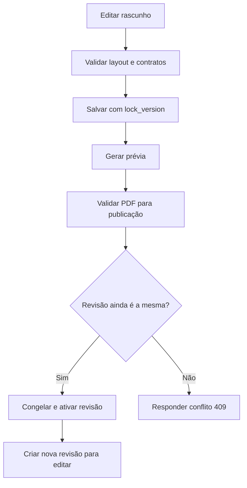

# Fluxos

Publicação gera PDF do exemplo antes de gravar, fecha a leitura do catálogo durante o worker e confirma por atualização condicional de status/lock_version. Alteração concorrente resulta em 409, preservando a revisão atual. Falha de PDF não publica conteúdo parcialmente validado.

Emissão: autenticar/autorização render → selecionar revisão publicada explícita ou ativa → validar JSON e parâmetros/defaults → compor HTML escapado → encerrar leitura → subprocesso limitado → bytes application/pdf, no-store. Dados inválidos geram JSON 422; capacidade ocupada 429; indisponibilidade/timeout 503. Nunca devolver stack trace ou conteúdo do stderr ao cliente.

Salvamento do rascunho valida estrutura e schema, mas aceita exemplo incompleto: prévia/publicação fazem a validação completa dos dados. Inputs bloqueados durante chamadas da IDE evitam sobrescrever alterações feitas durante a resposta. Conflito mantém a edição local para o usuário revisar.

Na emissão contextual, o documento principal carrega o modal/listener uma vez;
botões vindos de fragmentos AJAX usam delegação. GET /session estabelece token e
cookie antes da consulta do catálogo compatível. O POST envia somente identidade
do material/sessão/planta, template/revisão e parâmetros: o servidor obtém dados
pelo serviço público do consumidor, checa RBAC/escopo e chama o gerador central.
Falhas mantêm o modal com mensagem; sucesso oferece download, sem abrir popup.
