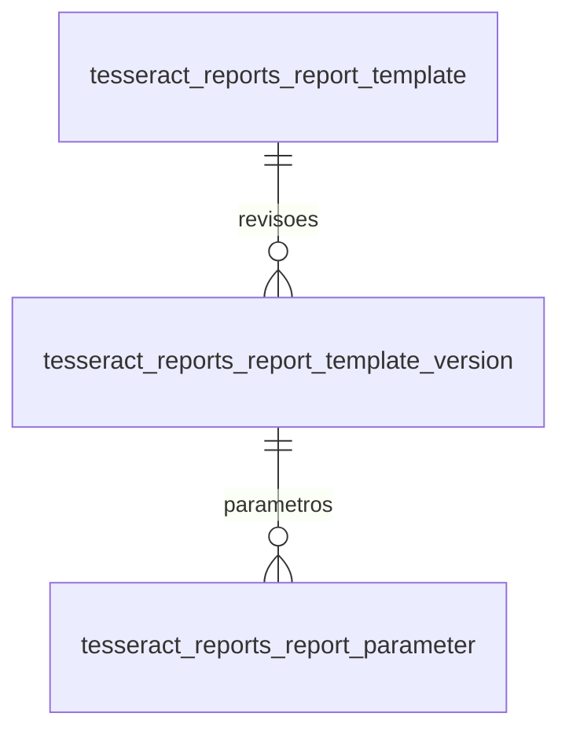

# Modelo de dados

| Tabela | Colunas relevantes | Regra |
|---|---|---|
| tesseract_reports_report_template | key única, name, active_version_number, autoria/timestamps | Identidade compartilhada; is_deleted/deleted_at preparados, sem operação de arquivamento nesta tela |
| tesseract_reports_report_template_version | template_id, version_number, status, lock_version, layout_json, data_schema_json, sample_data_json, content_hash | Sequência única por modelo; draft/published; publicação e edição controladas pelo serviço |
| tesseract_reports_report_block | key única, name, node_json, source_json, content_hash, lock_version, autoria/datas, is_deleted | Snapshot fixo compartilhado; arquivamento lógico; origem informativa sem FK para template |
| tesseract_reports_report_parameter | version_id, key, label, schema_json, is_required, has_default, default_json | Definição por revisão; has_default distingue ausência de null |

FKs internas usam objetos de coluna e respeitam o prefixo aplicado pelo ModuleManager. FKs de autoria para tesseract_user são permitidas pelas skills. Não existe FK cross-addon. A referência ativa é número de revisão do próprio modelo, validada por serviço; não se afirma que uma FK física a valida.

Layout schema_version=1 possui body, com IDs únicos, types text/table/section/divider e props tipadas. A UI inicial monta elementos de raiz text/table/divider; sections são suportadas pelo compositor, sem editor de aninhamento neste corte. Fontes e estilos de impressão são fixos. Modos livres e schemas com referências $ref/$dynamicRef são rejeitados.

O catálogo de blocos da etapa 7 possui tabela própria; registros de tipos de componentes e assets compartilhados permanecem planejados. Imagens PNG/JPEG deste corte ficam incorporadas em props.source no JSON da revisão, sem tabela adicional. Antes de evoluir versões publicadas, preservar um perfil/versionamento do compilador; atualmente apenas a versão declarativa v1 é suportada. Não há garantia de regeneração binariamente idêntica entre upgrades de motor/fontes.

Etapa 8: condition por componente e aggregate por coluna ficam no layout_json
da revisão e nos snapshots node_json dos blocos. Mesma versão declarativa v1,
sem colunas ou migration adicional. Sem expressão executável nos JSONs.
