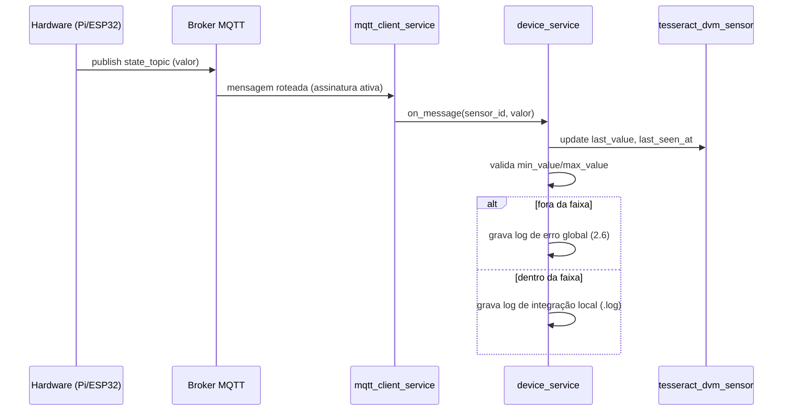
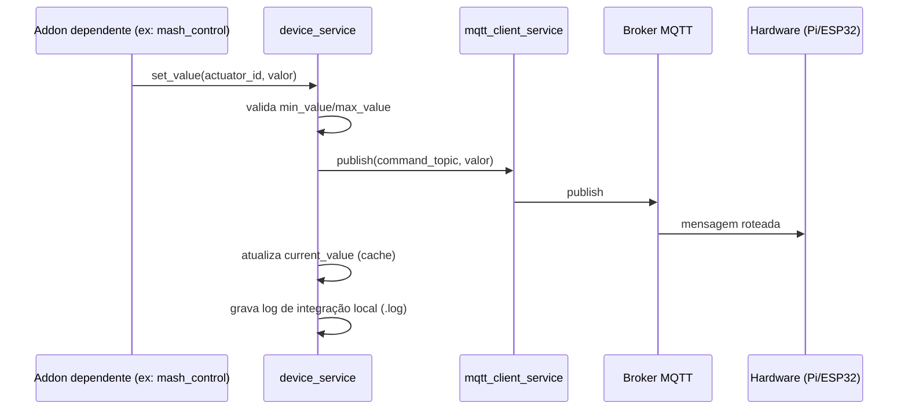
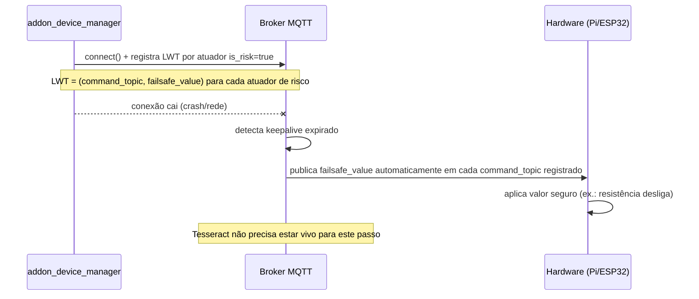

# 05 — Promoção de `feature_device_manager` a Addon + Integração MQTT

> **Status: Fases A–C EXECUTADAS (promoção estrutural concluída, 176
> testes passando). Fases D–G ainda pendentes (MQTT/EventBus).** Este
> documento começou como proposta e foi sendo atualizado conforme a
> execução avançou — seções marcadas [EXECUTADO] já refletem código
> real no repositório, não mais intenção.
>
> Convenção de status usada neste documento (em vez de ícone de cadeado,
> para evitar repetição visual confusa):
> - **[DECIDIDO]** — fechado, pronto para ser executado quando autorizado.
> - **[EXECUTADO]** — decidido e já implementado no código real.
> - **[ABERTO]** — ainda precisa de decisão antes de seguir.
> - **[PENDENTE-SKILL]** — decidido aqui, mas exige ajuste em skill já
>   existente (01–04) antes de poder ser executado sem conflito.

---

## 0. Decisão raiz

**[EXECUTADO]** `feature_device_manager` foi promovido de Feature para
**Addon independente** (`addon_device_manager`). `feature_mash_control`
(o único dependente até agora) passou a declarar a dependência
explicitamente via `"requires": ["device_manager"]` no manifesto.

**[EXECUTADO]** A ordem que foi seguida na prática: promoção estrutural
primeiro (Fase C), desenho de MQTT/EventBus depois (Fases D em diante,
ainda não implementadas) — diferente da ordem original deste documento
(que assumia desenho fechado primeiro). A inversão funcionou sem
problema, confirmando a observação já registrada na seção 8.

---

## 1. Identidade do módulo [EXECUTADO] (aplicação direta das skills 00–04)

| Aspecto | Antes (Feature) | Depois (Addon, estado real hoje) | Skill que rege |
|---|---|---|---|
| Pasta | `addons/addon_brewstation/features/feature_device_manager/` | `addons/addon_device_manager/` | 01 |
| Manifesto | `feature.json` | `addon.json` | 03 |
| Classe | `FeatureDeviceManager` | `AddonDeviceManager` | 01 |
| Campo de prefixo | `table_prefix_suffix: "dvm"` | `table_prefix: "dvm"` | 02 |
| Prefixo de tabela final | `tesseract_brewstation_dvm_[tabela]` | `tesseract_dvm_[tabela]` | 02 |
| Dependência de outros módulos | Implícita (acoplado ao pai) | Explícita: `feature_mash_control/feature.json` tem `"requires": ["device_manager"]` | 03 |
| Ciclo de ativação | Liga/desliga com o Addon pai | Independente (`ModuleManager` não bloqueia ativação de dependente hoje — gap conhecido, não resolvido nesta fase) | 03 |
| `docs/` | Compartilhado com o Addon pai | Ainda **pendente** — `docs/technical/` e `docs/manual/` próprios não foram criados (Fase G) | 04 |
| `i18n/` | Compartilhado com o Addon pai | Ainda **pendente** — `i18n/pt_BR.json` próprio não foi criado | 00 |

---

## 2. Decisões de arquitetura

### 2.1 [EXECUTADO] Sigla / `table_prefix`

`table_prefix: "dvm"` no `addon.json` — confirmado em produção.
Tabelas reais (ver seção 4 para o porquê dos nomes, revisado em
2026-06-26): `tesseract_dvm_device`, `tesseract_dvm_actor`,
`tesseract_dvm_function`, `tesseract_dvm_emulated_device`.

### 2.2 [DECIDIDO] API pública / dependentes

API mínima — `get_value` / `set_value` / `on_change`. Sem primitivas
extras (sequência, pulso, leitura em lote) por enquanto. Cresce só
quando um segundo dependente real (fermentação, CIP, dosagem) exigir
algo que o mínimo não cobre. **Ainda não implementada** (Fase D).

### 2.3 [DECIDIDO] Onde mora o cliente MQTT

**Opção A** — MQTT vive dentro do próprio `addon_device_manager`, não em
Plugin separado. Motivo: MQTT aqui é usado especificamente para
dispositivos IoT geridos por este Addon, não é transporte genérico do
Core. **Ainda não implementado** (Fase D) — pasta `services/` já existe
e já tem `device_function_lookup.py` (Fase 9), mas `mqtt_client_service.py`
e `device_service.py` ainda não foram criados.

```
addon_device_manager/root/services/
├── device_function_lookup.py  ← já existe (Fase 9)
├── mqtt_client_service.py     ← PENDENTE
└── device_service.py          ← PENDENTE
```

### 2.4 [EXECUTADO — revisado] Granularidade de tabela

**Decisão original (criar `Device`/`Sensor`/`Actuator` novos) foi
revertida em 2026-06-26.** Schema real reaproveitado e estendido — ver
seção 4 para o detalhe completo da revisão.

### 2.5 [DECIDIDO] Escopo de protocolo

MQTT é o único protocolo da v1. Multi-protocolo (Modbus/Serial/etc.) só
é avaliado depois do MQTT validado em produção — e mesmo assim como
**novas Features dentro do próprio `addon_device_manager`**
(ex.: `feature_modbus_bridge`), não como redesenho do core do Addon.

### 2.6 [DECIDIDO] Persistência / Logging — modelo de 3 camadas

| Tipo de dado | Onde fica | Formato |
|---|---|---|
| Estado atual / cache de valor | Banco (`tesseract_dvm_*`) | Tabela SQL, via `device_service` |
| Log de integração (valores recebidos, comandos enviados, eventos MQTT rotineiros) | Arquivo `.log` na pasta do próprio Addon | Arquivo local, não vai para banco nem log global |
| Erro maior (broker inacessível, payload inválido, falha de fail-safe) | Log global do Tesseract | Sistema de log central do Core |

Detalhamento de **onde** e **como configurar** essa pasta de log: ver
seção 3 (manifesto).

### 2.7 [DECIDIDO] Segurança MQTT e Fail-safe

**Autenticação:** nenhuma por agora — decidir depois. `MQTT_USERNAME`/
`MQTT_PASSWORD` continuam declarados como `env_keys` opcionais no
manifesto, só não são exigidos para o sistema funcionar.

**Fail-safe (LWT): necessário desde já.** Atuadores de risco (resistência,
bomba) precisam de um valor seguro publicado automaticamente pelo broker
se o Tesseract cair — schema já implementado em `DeviceActor`
(`failsafe_value`/`is_risk`, seção 4.2); fluxo de uso na seção 5.3. O
registro do LWT em si (`mqtt_client_service.py`) ainda está pendente.

---

## 3. Manifesto — real hoje vs. alvo com log configurável [PENDENTE]

O `addon.json` real (já no repositório) ainda **não** tem a seção
`logging` — é exatamente assim hoje:

```json
{
  "name": "device_manager",
  "label": "Device Manager",
  "version": "1.0.0",
  "description": "Gestão de dispositivos IoT (sensores/atuadores), funções e emulação. Promovido de Feature (addon_brewstation) a Addon independente.",
  "author": "S2M Tech",
  "type": "addon",
  "table_prefix": "dvm",
  "tesseract_min_version": "1.0.0",
  "requires": [],
  "provides": ["device_data", "device_actor_data", "device_function_data"],
  "features": [],
  "env_keys": [],
  "default_locale": "pt_BR",
  "available_locales": ["pt_BR"]
}
```

Alvo (Fase D), pasta de log **separada apenas para este Addon**, com
caminho configurável — não hardcoded:

```json
{
  "...": "... (campos acima inalterados) ...",
  "env_keys": [
    "MQTT_BROKER_HOST",
    "MQTT_BROKER_PORT",
    "MQTT_USERNAME",
    "MQTT_PASSWORD",
    "MQTT_CLIENT_ID",
    "MQTT_TOPIC_PREFIX"
  ],
  "logging": {
    "integration_log_enabled": true,
    "integration_log_path": "logs/integration.log",
    "integration_log_max_bytes": 5242880,
    "integration_log_backup_count": 5
  }
}
```

| Campo novo | Regra |
|---|---|
| `logging.integration_log_enabled` | `bool`, default `true`. Se `false`, módulo não grava log de integração local (só log global de erro continua valendo). |
| `logging.integration_log_path` | Caminho **relativo à pasta do próprio Addon** (nunca absoluto, nunca fora de `addons/addon_device_manager/`). Default sugerido: `logs/integration.log`. |
| `logging.integration_log_max_bytes` / `backup_count` | Parâmetros de rotação (`RotatingFileHandler`), evita o `.log` crescer sem limite. |

**[PENDENTE-SKILL]** — Isso introduz dois pontos que as skills 01 e 03
ainda não previam e precisam de uma adenda formal antes da execução:
- Skill 01: adicionar `logs/` à estrutura padrão de pastas de um Addon
  (hoje a árvore documentada não tem essa pasta).
- Skill 03: adicionar a seção `logging` ao schema de `addon.json` como
  campo **opcional e específico de Addon** (Plugin pode querer o mesmo
  padrão depois, mas isso fica fora do escopo deste documento).

Por ser configurável (e não fixo em código), qualquer Addon futuro que
precise do mesmo padrão de log local replica a mesma seção `logging` no
seu próprio `addon.json` — não é uma exceção exclusiva do
`device_manager`, é um padrão novo opcional, só que o `device_manager` é
o primeiro a usá-lo.

---

## 4. Modelagem — extensão do schema real (revisado em 2026-06-26)

> **Revisão importante:** o desenho original abaixo (4.1–4.3, mantido
> como histórico) assumia tabelas `Device`/`Sensor`/`Actuator` novas.
> Ao revisar o código real (Fase 6, já implementado e testado — 175
> testes passando antes desta revisão), constatamos que
> `DeviceMetadata`/`DeviceActor`/`DeviceFunction` já cobrem exatamente o
> mesmo problema, de forma mais madura (inclusive já resolvendo a
> questão de "um device com múltiplas portas mistas" via
> `DeviceActor.actor_type` por porta). **Decisão: estender, não
> recriar.**

### 4.1 (revisado) O que já existe e é reaproveitado sem alteração

| Tabela real | Papel | Equivalência ao desenho original |
|---|---|---|
| `tesseract_dvm_device` (`DeviceMetadata`) | Identidade do nó físico (`name`, `device_type`, `protocol`, `port_config` JSON) | Equivalente a 4.1 (`Device`) |
| `tesseract_dvm_actor` (`DeviceActor`) | Uma porta do device + função atribuída (`port_name`, `actor_type`: sensor/actuator/rule_trigger, `config_json`) | Equivalente a 4.2+4.3 combinados (`Sensor`/`Actuator`) — `actor_type` já resolve "tipo por porta" |
| `tesseract_dvm_function` (`DeviceFunction`) | Catálogo de funções reutilizáveis (`min_value`, `max_value`, `unit`, `data_type`) | Não existia no desenho original — é uma melhoria: evita repetir min/max/unidade em cada porta |

### 4.2 (revisado) O que foi adicionado a `DeviceActor` (única migration desta fase)

| Coluna nova | Tipo | Obrigatória | Observação |
|---|---|---|---|
| `failsafe_value` | String(50), nullable | Não | Valor publicado via LWT se o Tesseract cair (decisão 2.7). Coluna real (não dentro de `config_json`) porque o `mqtt_client_service` precisa filtrar em massa (`WHERE is_risk = true`) na conexão, sem desserializar JSON linha a linha. Serializado como string, interpretado conforme `DeviceFunction.data_type` na hora de publicar. |
| `is_risk` | Boolean, default `false` | Sim | Marca se este ator (só relevante para `actor_type="actuator"`) exige LWT ativo. Default `false` (em vez do `true` do desenho original) — mais consistente com o padrão do projeto de não assumir risco sem o usuário declarar explicitamente; rever se a operação real mostrar que `true` por padrão é mais seguro na prática. |

`mqtt_config` (tópicos, qos, retain) e `hardware_mapping` (pin,
pwm_frequency, platform) **não** ganham coluna própria — vivem dentro
do `config_json` que `DeviceActor` já tem, via `get_config()`/
`set_config()` já existentes. Não há FK nova nem tabela nova.

### 4.3 (revisado) Onde mora o tópico MQTT, então

`DeviceActor.config_json` passa a aceitar (convenção, não enforced por
schema):
```json
{
  "mqtt_config": {
    "state_topic": "sensors/mash_tun_temp/state",
    "command_topic": "actuators/mash_heater/set",
    "qos": 1,
    "retain": false
  },
  "hardware_mapping": {
    "pin": 18,
    "pwm_frequency": 1000
  }
}
```
`DeviceActor.external_id` (já existente) é o identificador usado nos
tópicos quando não houver `mqtt_config` explícito — fallback razoável,
já é UUID estável.

### 4.4 Nota de FK (mantida do desenho original, sem mudança)

`DeviceActor.device_id` → `DeviceMetadata.id` e `DeviceActor.function_id`
→ `DeviceFunction.id` são FKs internas ao próprio Addon, permitidas pela
skill 02. Nenhuma FK sai para outro Addon — quem depender
(`mash_control`) usa referência fraca por `name` + service público
(`device_function_lookup.py`, já implementado na Fase 9), nunca FK
direta — ver seção 9 (status) para o detalhe dessa correção, que já foi
executada antes desta revisão de schema.

---

<details>
<summary>Desenho original (4.1–4.3 da primeira versão) — mantido só como histórico, substituído pela seção acima</summary>

### 4.1 `tesseract_dvm_device` — catálogo base (identidade física do nó) [SUBSTITUÍDO]

Representa só a **identidade do nó físico** (a placa/gateway) — nunca o
tipo de IO. Um `Device` pode ter N `Sensor` e M `Actuator` simultaneamente
(ex.: um ESP32 com sensor de temperatura e relé de bomba no mesmo nó), por
isso não existe campo "tipo" aqui — quem responde "sensor ou atuador" é a
porta (4.2/4.3), não o device.

| Coluna | Tipo | Obrigatória | Observação |
|---|---|---|---|
| `id` | Integer, PK | Sim | Padrão Core (skill 02) |
| `external_id` | UUID | Sim | Padrão Fase 6 (Integer PK + UUID estável), mantido |
| `name` | String | Sim | Nome de exibição (PT-BR, digitado pelo usuário, não é `translation_key`) |
| `platform` | String (`raspberrypi` / `esp32` / `generic`) | Sim | Plataforma de hardware, livre para crescer |
| `connection_status` | String (`online` / `offline` / `unknown`) | Sim | Derivado do `last_seen_at` mais recente entre todas as portas do device, ou de heartbeat próprio (a definir na modelagem fina) |
| `is_active` | Boolean | Sim | Default `true` — permite desativar sem apagar |
| `created_at` / `updated_at` | DateTime | Sim | Padrão skill 02 |
| `is_deleted` / `deleted_at` | Boolean / DateTime | Sim | Soft-delete padrão CrudGen |

### 4.2 `tesseract_dvm_sensor` — especialização de leitura [SUBSTITUÍDO]

| Coluna | Tipo | Obrigatória | Observação |
|---|---|---|---|
| `id` | Integer, PK | Sim | |
| `device_id` | Integer, FK → `tesseract_dvm_device.id` | Sim | FK permitida (mesmo Addon, mesma regra da skill 02) |
| `subtype` | String (`digital` / `analog` / `temperature` / ...) | Sim | |
| `state_topic` | String | Sim | Tópico MQTT de leitura (`brewery/sensors/<id>/state`) |
| `unit` | String | Não | Ex.: `°C`, `%`, `bar` |
| `min_value` / `max_value` | Float | Não | Faixa de validação — fora da faixa, vira log de erro global (2.6) |
| `last_value` | Float/String | Não | Cache do último valor recebido |
| `last_seen_at` | DateTime | Não | Última telemetria recebida — base para detectar dispositivo offline |

### 4.3 `tesseract_dvm_actuator` — especialização de comando [SUBSTITUÍDO]

| Coluna | Tipo | Obrigatória | Observação |
|---|---|---|---|
| `id` | Integer, PK | Sim | |
| `device_id` | Integer, FK → `tesseract_dvm_device.id` | Sim | |
| `subtype` | String (`digital` / `pwm`) | Sim | |
| `command_topic` | String | Sim | Tópico MQTT de comando (`brewery/actuators/<id>/set`) |
| `state_topic` | String | Não | Tópico de confirmação de estado, se o hardware publicar |
| `min_value` / `max_value` | Float | Não | Faixa válida (ex.: PWM 0–100) |
| `current_value` | Float/Bool | Não | Cache do último comando enviado |
| `failsafe_value` | Float/Bool | **Sim** | Valor publicado via LWT se o Tesseract cair (decisão 2.7) |
| `is_risk` | Boolean | Sim | Marca se este atuador exige LWT ativo |

</details>

---

## 5. Fluxos (preparação para `docs/technical/03-fluxos.md` quando o Addon nascer)

### 5.1 Fluxo de leitura de sensor (caminho feliz)



### 5.2 Fluxo de comando de atuador (caminho feliz)



### 5.3 Fluxo de fail-safe (LWT) — conexão do Tesseract cai



Esse terceiro fluxo é o motivo pelo qual `failsafe_value`/`is_risk`
precisam estar na tabela (4.3) e não só em configuração externa — o
`mqtt_client_service` lê esses valores do banco **no momento da conexão**
para montar os LWTs antes de qualquer falha acontecer.

---

## 6. Convenção MQTT vs. EventBus (rascunho da futura skill 05)

| Canal | Escopo | Convenção de nome |
|---|---|---|
| **EventBus** (interno, Addon ↔ Addon) | Já coberto pela skill 00 | `[modulo].[entidade].[acao]`, ex. `device_manager.sensor.value_changed` |
| **MQTT** (externo, Tesseract ↔ hardware) | Ainda não coberto por skill nenhuma | Proposto: `[topic_prefix]/[tipo]/[device_id]/[state\|set]`, ex. `brewery/sensors/mash_tun_temp/state` — fora do `snake_case` interno porque é payload de protocolo externo |

**[ABERTO]** Formalizar isso como skill 05 só quando todo o desenho do
Addon estiver validado em uso real — por ora fica registrado aqui como
rascunho de referência.

---

## 7. Árvore consolidada (estado real após Fase 9 + extensão da seção 4)

```
addons/
└── addon_device_manager/                  ← promovido na Fase 9 (já executado)
    ├── addon.json                         ← table_prefix: "dvm" (seção logging ainda pendente, seção 3)
    ├── addon.py                           ← class AddonDeviceManager(AddonBase)
    ├── root/
    │   ├── model/
    │   │   ├── device_metadata.py         ← tesseract_dvm_device (identidade do nó)
    │   │   ├── device_actor.py            ← tesseract_dvm_actor (porta+função; +failsafe_value/is_risk, seção 4.2)
    │   │   ├── device_function.py         ← tesseract_dvm_function (catálogo reutilizável)
    │   │   └── emulated_device.py         ← tesseract_dvm_emulated_device
    │   ├── services/
    │   │   ├── device_function_lookup.py  ← já implementado (Fase 9) — resolução cross-Addon por name
    │   │   ├── device_service.py          ← PENDENTE — API pública get_value/set_value/on_change
    │   │   └── mqtt_client_service.py     ← PENDENTE — paho-mqtt + registro de LWT (lê is_risk/failsafe_value)
    │   ├── controller/
    │   ├── api/routes/
    │   └── templates/
    ├── logs/                              ← PENDENTE (skill 01 ainda não tem adendo formal)
    │   └── integration.log
    ├── i18n/pt_BR.json                    ← PENDENTE (ainda não criado)
    ├── static/
    └── docs/
        ├── technical/                     ← PENDENTE (skill 04)
        └── manual/                        ← PENDENTE (skill 04)

addons/addon_brewstation/features/feature_mash_control/
└── feature.json: "requires": ["device_manager"]   ← já implementado (Fase 9)
```

---

## 8. Plano de execução — progresso real

### Fase A — Adendas de skill [PENDENTE]
1. Adendo skill 01: incluir `logs/` na estrutura padrão de Addon.
2. Adendo skill 03: incluir seção `logging` no schema de `addon.json`.
3. **Ainda bloqueante** para a Fase D usar `logs/integration.log` sem
   violar a regra de ouro do projeto — não foi pulado, só ainda não
   chegou a vez (a promoção estrutural em si não dependia disso).

### Fase B — Modelagem fina [EXECUTADO, revisado]
4–6. Revisão concluída em 2026-06-26: em vez de `Device`/`Sensor`/
`Actuator` novos, `DeviceActor` foi estendido com `failsafe_value`/
`is_risk` (seção 4). Migration `7b3e9c1a2d4f` aplicada. O LWT em si
(`mqtt_client_service.py` lendo esses campos na conexão) ainda não foi
implementado — só o schema que ele vai consultar.

### Fase C — Promoção estrutural [EXECUTADO]
7–10. Pasta movida (`git mv`), reestruturada (`root/`), `addon.json`
próprio, `AddonDeviceManager`, rotas renomeadas (`/device-manager/...`),
`feature_mash_control` com `requires: ["device_manager"]`, migration
`4a8524f00549` (rename de tabela + backfill das 3 FKs removidas).
**Dois bugs reais de Core encontrados e corrigidos durante a execução**
(não previstos neste documento): `ModuleManager._template_dir_for()`
não resolvia `root/templates/` de Addon top-level, e
`discover_and_register_addons()` nunca registrava o módulo dinâmico em
`sys.modules`. Ver `BACKLOG.md`, Fase 9, para o detalhe completo.

### Fase D — Implementação do núcleo do Addon [PENDENTE — próxima]
11. ~~Models via CrudGen~~ — não se aplica mais; schema já existe e já
    foi estendido (Fase B revisada).
12. `device_service.py` — API `get_value`/`set_value`/`on_change`,
    operando sobre `DeviceActor`/`DeviceMetadata` reais.
13. `mqtt_client_service.py` — conexão, publish/subscribe, registro de
    LWT lendo `is_risk`/`failsafe_value` de `DeviceActor` na conexão.
14. Log de integração local — **bloqueado pela Fase A** (precisa da
    adenda de skill antes, ou aceitar um log "fora do padrão" por ora
    e migrar depois — decisão a tomar ao iniciar a Fase D).

### Fase E — Integração com o primeiro dependente [PENDENTE]
15–16. `feature_mash_control` ainda é escopo CRUD puro (sem motor de
automação ativo, conforme já registrado no `BACKLOG.md` antes desta
Fase 9) — a "integração" aqui é mais preparar o terreno do que religar
lógica existente.

### Fase F — Validação ponta a ponta [PENDENTE]
17–18. Spec do lado hardware já escrita em conversa separada:
`tesseract-device-bridge` (repositório próprio, fora do Tesseract) —
GPIOBackend simulado/real, painel manual de fallback, compatível com o
schema desta seção 4.

### Fase G — Documentação e fechamento [PENDENTE]
19–21. `docs/technical/`/`docs/manual/` do Addon, formalização da
skill 05, `BACKLOG.md`/`README.md` (já vêm sendo atualizados
incrementalmente a cada etapa, não só no fechamento final).

---

### Observação sobre ordem alternativa

Confirmado na prática: Fase C foi executada **antes** do desenho de
MQTT estar fechado (inversão em relação à intenção original deste
documento) e funcionou sem problema — A promoção estrutural é
independente do desenho de protocolo. O que continua valendo como
regra real: Fase A antes de qualquer `logs/` ser usado, Fase B antes de
qualquer migration nova.


---

## 9. Status consolidado (atualizado em 2026-06-26)

**Executado:** Fases **B e C** (promoção estrutural completa, extensão
de schema em `DeviceActor`, 176 testes passando, dois bugs de Core
corrigidos). **Pendente, em ordem real de bloqueio:**

1. **Fase A** — adendas formais às skills 01 (`logs/`) e 03 (seção
   `logging`). Bloqueia o início "limpo" da Fase D (log de integração
   local), mas não bloqueou nada do que já foi feito.
2. **Fase D** — `device_service.py` + `mqtt_client_service.py`. Schema
   que eles vão consultar já está pronto (`DeviceActor.failsafe_value`/
   `is_risk`, `config_json` com `mqtt_config`/`hardware_mapping`).
3. **Fase E** — integração com `feature_mash_control` (hoje CRUD puro).
4. **Fase F** — validação ponta a ponta com `tesseract-device-bridge`
   (spec já escrita, repositório separado).
5. **Fase G** — docs técnicos/manual do Addon (skill 04), formalização
   da skill 05 (seção 6 deste documento).
