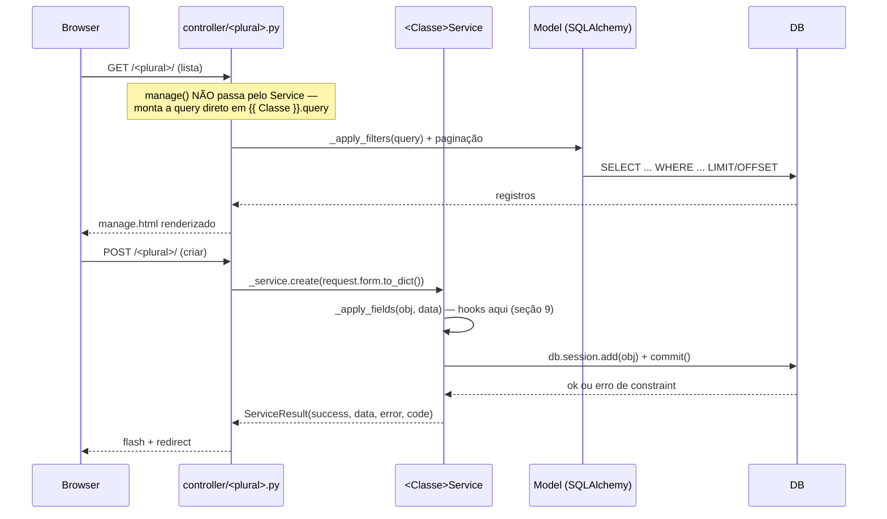

# 12 — CrudGen: Referência Completa, Guia Operacional e Anotações

> **Status: REFERÊNCIA DESCRITIVA + guia prático.** Esta skill funde
> os antigos documentos `12-crudgen-referencia-completa.md` e
> `13-crudgen-guia-operacional.md` — a fusão não muda nenhuma regra,
> só reorganiza (consolidação Fase 1, 2026-09). Os dois já eram
> companheiros sem sobreposição de conteúdo (12 documentava *o que
> existe* — pipeline, anotações, artefatos gerados, `--overwrite`/
> `--only`; 13 documentava *como trabalhar* com uma entidade já gerada
> no dia a dia — fluxo de objetos, hooks, checklist, cookbook).
> Mantê-los juntos evita alternar entre dois arquivos para responder
> "o que essa anotação faz" e "onde eu intercepto isso".
>
> Seções 1–7 vêm do antigo documento 12 (referência); seções 8–12 vêm
> do antigo documento 13 (operação). `@required`/`@max_length`/
> `@min_length`/`@min_value` e o seed de `FieldRule` a partir delas
> (seção 5), `--only templates` (seção 3), e a migração de 3 módulos
> reais para auto-descoberta (seção 7, skill 09) estão todos
> **[EXECUTADO]**.

---

## 1. Pipeline de ponta a ponta

```
1. Developer escreve model.py anotado (@label, @plural, @choices, etc.)
       ↓
2. python run.py generate --model <path> --addon <nome> [--feature <nome>] [--overwrite] [--only templates]
       ↓ (core/cli.py::generate_cmd)
3. Resolve a classe do model no arquivo (reimport pelo dotted path real — seção 6)
       ↓ (core/crudgen/generator.py::generate)
4. resolve_table_prefix() lê addon.json/feature.json → prefixo tri-nível (skill 02)
5. apply_table_prefix() renomeia __tablename__ do model em runtime
6. get_model_metadata() extrai as anotações (seção 2)
7. Loop nos artefatos (todos, ou só templates se --only): renderiza, escreve
   (hooks só na primeira vez — seção 3)
8. sync_model_permissions() grava as permissões CRUD automáticas + @permission
9. sync_field_rules_from_validations() semeia FieldRule a partir de
   @required/@max_length/@min_length/@min_value (só na criação — seção 5)
       ↓
10. Resultado: service/controller/routes (+ hooks) + manage.html + detail.html
    prontos. Falta só registrar em register_models()/register_routes()
    do addon.py/feature.py (manual, OU automático se o módulo usar o
    default de auto-descoberta — seção 7) e o próximo boot criar a tabela.
```

**Nada disso cria tabela no banco.** `generate()` só escreve arquivo. A
tabela nasce no próximo boot (`db.create_all()`) ou via migration.

---

## 2. Catálogo de anotações — guia de uso completo

Todas as anotações abaixo, **exceto as da seção 2.5**, são **ativas**
— afetam geração real ou runtime real.

### 2.1 Identidade e apresentação

**`@label(valor)`**
```python
@label("Malte")
class Malte(db.Model): ...
```
Nome de exibição da entidade — título de página, mensagens, etc.
Sem ela, cai no `__name__` da classe (`get_model_metadata()`).

**`@plural(valor)`**
```python
@plural("maltes")
class Malte(db.Model): ...
```
Nome plural — vira o nome do Blueprint, prefixo de URL
(`/brewstation/maltes`, `/api/brewstation/maltes`), nome da pasta de
template (`templates/maltes/`), nome de permissão (`maltes.list`,
`maltes.create`, ...) e a chave usada por `@weak_ref(options=...)`
(seção 4) pra achar `/api/options/maltes`. **Quase todo nome gerado
deriva daqui** — é a anotação mais "pesada" em efeito.

**`@menu_icon(valor)`**
```python
@menu_icon("bi-flask")
class Malte(db.Model): ...
```
Ícone Bootstrap Icons — **só tem efeito se `get_transactions()` do
módulo for o default auto-gerado** (skill 09, seção 7 abaixo). Se o
módulo escreve `get_transactions()` à mão (caso mais comum nos
módulos reais deste projeto), essa anotação é ignorada — o ícone vem
direto do dict escrito à mão.

### 2.2 Validação — HTML5 nativo + `FieldRule`

**`@required(campo, message=None)`**
```python
@required("nome", message="Nome do material é obrigatório")
class Material(db.Model): ...
```
Efeito real, dois lugares:
1. **HTML5 nativo**: `<input required>` + badge `<span class="text-danger">*</span>`
   no label, em `manage.html`/`detail.html` gerados.
2. **`FieldRule` semeada** (`entity_key=<plural>`, `field_name=<campo>`,
   `rule_id="obrigatorio"`) — liga ao motor real de validação
   client-side (`static/js/rule_engine.js`, skill 07b), a mesma tela
   admin de Field Rules que já existia. **Só na criação** — depois
   disso o admin é dono do registro (mesmo espírito de hook, seção 3).

**`@max_length(campo, max, message=None)`**
```python
@max_length("sku", 60, message="SKU deve ter no máximo 60 caracteres")
```
HTML5 `maxlength="60"` + `FieldRule(rule_id="max_length")`.

**`@min_length(campo, min, message=None)`**
```python
@min_length("nome", 3, message="Nome deve ter no mínimo 3 caracteres")
```
HTML5 `minlength="3"` + `FieldRule(rule_id="min_length")`.

**`@min_value(campo, min, message=None)`**
```python
@min_value("cor_ebc", 0, message="Cor EBC não pode ser negativa")
```
Campo vira `<input type="number" min="0">` (só quando tem
`@min_value` — outros campos numéricos sem essa anotação continuam
`type="text"`, decisão proposital para não mexer em campo que
ninguém pediu) + `FieldRule(rule_id="min_valor")`.

**Não existe `@max_value`** — só `min_value` foi portado do PyTeca.
O catálogo de regras (`core/rules_catalog.py`) já tem `max_valor`/
`maxValue` pronto, só falta a anotação — registrado para simetria
futura, não implementado.

**`@field_labels({campo: rótulo, ...})`** — resolve um achado real:
`manage.html`/`detail.html` gerados sempre mostravam
`field.replace('_', ' ').title()` como rótulo — nunca passava pelo
i18n da skill 00, produzindo texto tipo "Container Type" em vez de
"Tipo". Sem essa anotação, o campo continua caindo no fallback de
sempre — comportamento anterior preservado, nenhum model existente
quebra.
```python
@field_labels({
    "container_type": "Tipo",
    "device_id": "Dispositivo",
    "description": "Descrição",
})
```
Mesma convenção de "conveniência de autoria" do `@label`/
`Column(label=...)` (skill 00) — texto direto aqui, ainda não
resolvido via `i18n/pt_BR.json`. Resolver isso definitivamente (gerar
a chave de tradução a partir do texto, em vez de hardcode por model) é
decisão em aberto da análise de field metadata registrada no backlog
(tipos SQLAlchemy → HTML + validação) — essa anotação é o mínimo para
parar de mostrar rótulo em inglês nas telas que já existem, sem
esperar a análise maior.

**`@readonly_fields([campo, ...])`** — soma campos ao conjunto padrão
que já é somente-leitura tanto no formulário (`controller.py.j2` —
campo nem aparece editável) quanto na camada de serviço
(`service.py.j2::_apply_fields` — mesmo que alguém mande o campo via
API/JSON direto, é ignorado). **Achado real**: a primeira versão só
protegia o formulário; a proteção do service veio depois, ao notar
que a API contornava a proteção da tela sem querer. Uso real:
`YeastBankEvent.starter_id`/`cell_count_id`/`status_before` são
preenchidos só pelo hook `post_create_redirect`, nunca escolhidos na
tela nem aceitos via payload direto.
```python
@readonly_fields(["starter_id", "cell_count_id"])
```

**Hooks de controller — achado real: nunca eram chamados de
verdade.** `controller.py.j2`/`routes.py.j2` sempre tiveram o
docstring "Customizações via `X_hooks.py`" — mas nenhum dos dois
importava ou chamava esse arquivo. `X_hooks.py` existia, era criado
pelo CrudGen, só nunca foi conectado a nada (diferente de
`X_service_hooks.py`, que sempre teve `pbo_apply_fields`/
`pai_apply_fields` reais — seção 9). Corrigido com o mesmo padrão
seguro já usado no service (`try/except ImportError` + `_hook(name)`
com fallback no-op — hook ausente nunca quebra nada). Dois hooks
reais, ambos opcionais:

- **`block_create(data) -> str | None`** — chamado no início de
  `create()` (web **e** API). Retornar uma string bloqueia a criação
  (mostra a string como erro); retornar `None` (ou não definir a
  função) deixa criar normalmente.
- **`post_create_redirect(item) -> Response | None`** — chamado depois
  que `create()` salva com sucesso, **tanto na rota web quanto na
  API** (achado real: a primeira versão só chamava na web, e a API
  virava um jeito de criar o evento sem disparar a criação
  automática do registro especializado — bug de contorno silencioso).
  Na web, um `Response` retornado (via `redirect(url_for(...))`) troca
  o destino padrão (`{{ plural }}.manage`); na API o valor de retorno
  é descartado de propósito (JSON não redireciona) — só os efeitos
  colaterais do hook importam ali. Uso real: criar um `YeastBankEvent`
  tipo "Contagem de Células" cria automaticamente o
  `YeastCellCountHistory` vinculado e, na web, redireciona para edição
  dele.

### 2.3 Referência fraca e busca cross-módulo

**`@display_field(valor)`**
```python
@display_field("nome")
class Material(db.Model): ...
```
Campo que representa o "nome" do registro para qualquer consumidor
externo — usado por `/api/options/<plural>` (busca) e por qualquer
função-resolver de `@weak_ref` (convenção: a função deve usar isso
para montar a chave `"display"` do retorno, nunca hardcoded).

**`@weak_ref(campo, resolver, options=None)`**
```python
@weak_ref("material_id",
           resolver="addons.addon_estoque.root.services.material_lookup.get_material",
           options="materials")
class Malte(db.Model):
    material_id = db.Column(db.Integer, nullable=False, index=True)  # SEM FK
```
Ver seção 4 — resolve id cru em nome legível na lista; vira combo de
busca (`options=`) ou texto de apoio (sem `options=`) no formulário de
detalhe.

**`@choices(campo, label=None, order="asc")`**
```python
@choices("tipo", label="Tipo")
class Malte(db.Model): ...
```
Vira filtro `<select>` em `manage.html`, com valores `DISTINCT` reais
do banco (não uma lista fixa) — atualiza sozinho conforme dado novo
entra.

### 2.4 Permissão de negócio

**`@permission(action, role_required=None, description=None)`**
```python
@permission("trash", role_required="brewmaster", description="Mover lote para a lixeira")
class MashRecipe(db.Model): ...
```
Cria permissão extra (`<plural>.<action>`) além das 7 automáticas
(`list`/`detail`/`create`/`update`/`trash`/`restore`/`delete_permanent`)
— Camada 2. Se `role_required` for passado, a Role é criada (se não
existir) e a permissão anexada a ela automaticamente.

### 2.5 [ABERTO] Vestigiais

`@listview`, `@form`, e as classes `Column`/`Filter`/`Group` **continuam
sem nenhum consumidor**. Decidir se ligam a algo real, se somem do
módulo, ou se ficam documentadas como estão — ver `BACKLOG.md` para
retomar quando quiser.

---

## 3. Os 10 artefatos gerados + hooks + `--overwrite` + `--only`

> Desde a skill 25 (2026-09-01), a lista abaixo tem 2 hooks de
> TEMPLATE (`_acoes_em_massa_extra.html`/`_detail_extra.html`) além
> dos 3 hooks Python já existentes — 5 hooks + 5 não-hook, 10 no
> total. Ver skill 25, seção 1.4, para o raciocínio completo de por
> que esse tipo de hook passou a existir.

```python
_FILES_TO_GENERATE = [
    ("service.py.j2",         "services/{snake_singular}_service.py",         False),
    ("service_hooks.py.j2",   "services/{snake_singular}_service_hooks.py",   True),
    ("controller.py.j2",      "controller/{plural}.py",                       False),
    ("controller_hooks.py.j2","controller/{plural}_hooks.py",                 True),
    ("routes.py.j2",          "api/routes/{plural}_routes.py",                False),
    ("routes_hooks.py.j2",    "api/routes/{plural}_routes_hooks.py",          True),
    ("manage.html.j2",        "templates/{plural}/manage.html",               False),
    ("detail.html.j2",        "templates/{plural}/detail.html",               False),
    ("acoes_em_massa_extra_hook.html.j2", "templates/{plural}/_acoes_em_massa_extra.html", True),
    ("detail_extra_hook.html.j2",         "templates/{plural}/_detail_extra.html",         True),
]
```

**Override de ciclo de vida (2026-09, ledger de estoque):** o service gerado consulta opcionalmente `create_override(data)`, `update_override(id, data)`, `trash_override(id)`, `restore_override(id)` e `delete_permanent_override(id)` no hook antes do CRUD padrão. Cada função devolve `ServiceResult` para assumir a operação, ou `None` para deixar o padrão rodar. O hook pode importar `ServiceResult` tardiamente para evitar importação circular. O ledger usa `create_override` para delegar ao serviço central de estoque e bloqueia mutações dos lançamentos. O Saldo usa o mesmo mecanismo para permitir apenas limites operacionais. Anotações de exibição `__crudgen_immutable__`, `__crudgen_no_create__` e `__crudgen_no_delete__` controlam a tela gerada; a proteção efetiva é feita no service.

**Hooks nunca são sobrescritos — comprovado empiricamente** (marcador
manual inserido num hook existente sobreviveu a `generate --overwrite`
real; log confirma "N hook(s) preservado(s)"). A checagem de hook roda
**antes** de qualquer checagem de `overwrite` no código. Os 2 hooks de
template seguem exatamente a mesma regra dos 3 hooks Python — só a
extensão (`.html` em vez de `.py`) e o propósito mudam (absorver
seção/botão HTML hand-made em vez de código Python hand-made).

**`--overwrite`**: reescreve os 5 artefatos não-hook. Tudo-ou-nada,
a menos que `--only` seja usado.

**`--only templates`**: restringe a regeneração aos 4 artefatos de
template — `manage.html`/`detail.html` (sempre reescritos) + os 2
hooks de template (só escritos na primeira vez; se já existirem,
entram em "hooks preservados" como qualquer outro hook). **Exige
`--overwrite` junto** — sem isso, `generate()` levanta `ValueError`
explícito. Uso:
```
python run.py generate --model <path> --addon <nome> --overwrite --only templates
```
Não roda o seed de `FieldRule` (seção 5) — esse é só de geração
completa.

**Risco real testado (skill 20)**: `--only templates` sozinho **quebra**
(`jinja2.exceptions.UndefinedError`) numa entidade cujo `controller.py`
nunca foi regenerado desde que uma variável nova passou a ser exigida
pelo template (`field_labels`; `html_type` dentro de
`field_html_validations` — skill 20). O HTML novo referencia uma
variável que o controller antigo nunca calculou nem passou para
`render_template()`. Reproduzido de propósito rodando `--only
templates` em `DeviceFunction` (fora do `feature_yeast_bank`, controller
gerado antes da skill 15) — `manage()` quebrou com 500 na hora.
**Regra prática**: depois de uma mudança que adiciona uma variável nova
consumida pelos templates (não só ajusta HTML), a primeira regeneração
de cada entidade precisa ser **sem** `--only` (os 5 artefatos, controller
incluído) — só depois disso `--only templates` volta a ser seguro para
essa entidade.

**Dois modos de template**: `.py.j2` usa Jinja2 real na hora de
gerar; `.html.j2` usa substituição de string simples
(`@@label@@`/`@@plural@@`/`@@class_name_lower@@`) porque o HTML
gerado **também é** um template Jinja, processado depois pelo Flask
em runtime — qualquer lógica nova em HTML gerado é Jinja **literal**
no `.j2`, nunca avaliada na hora de gerar.

---

## 4. Referência fraca → combobox

1. Model **alvo** ganha `@display_field("nome")`.
2. Model **que TEM** a referência fraca ganha `@weak_ref(campo,
   resolver=, options=)`.
3. Controller gerado lê `get_weak_refs(Classe)`, monta `_WEAK_REFS`.
4. `manage()`/`detail()` chamam o `resolver` via `importlib` (nunca
   importa o model alvo direto) — pega a chave `"display"`.
5. `manage.html`: célula da lista substitui valor cru pelo resolvido.
6. `detail.html`: **nunca** sobrescreve `value=` do input (quebraria o
   submit). Com `options=` → combo de busca
   (`static/js/weak_ref_combo.js`, vanilla JS, chama
   `/api/options/<options>`). Sem `options=` → texto de apoio ao lado.
7. `/api/options/<plural>` (`api/routes/core/options_routes.py`) — só
   elegível para model com `@display_field` (whitelist implícita).

**Gap conhecido, não resolvido**: o formulário inline de "Novo
registro" em `manage.html` não ganha o combo — só `detail.html` tem
isso hoje.

---

## 5. Validação — antes e depois de `@required`/`@max_length`/`@min_length`/`@min_value`

**Antes**: essas 4 anotações populavam `cls._validations`, mas nada
lia esse valor — decorativas. A única validação real vinha de
`FieldRule` (tabela, configurada à mão pela tela admin de Field
Rules), sem nenhuma ligação com anotação de model.

**Depois**: as 4 anotações agora **alimentam os dois mecanismos que
já existiam, sem inventar um terceiro**:
- HTML5 nativo direto no `<input>` gerado (seção 2.2).
- Seed de `FieldRule`, create-only (`generator.py::_seed_field_rules_from_validations`),
  usando o catálogo de `rule_id` que **já existia**
  (`core/rules_catalog.py`, grupo "Validação"):

| Tipo da anotação | `rule_id` | `js_function` |
|---|---|---|
| `required` | `obrigatorio` | `required` |
| `max_length` | `max_length` | `maxLength` |
| `min_length` | `min_length` | `minLength` |
| `min_value` | `min_valor` | `minValue` |

**Create-only é proposital**: regenerar (`--overwrite`) não pode
reverter uma customização que o admin fez na `FieldRule` depois —
mesmo espírito de hook (`*_hooks.py`), aplicado a dado em banco em vez
de arquivo. Testado explicitamente: editar `params_json` de uma
`FieldRule` já semeada, regenerar de novo, a edição sobrevive.

---

## 6. CLI — referência completa

```
python run.py generate --model <caminho/model.py> --addon <nome> [--feature <nome>] [--class-name <Nome>] [--overwrite] [--only templates]
```

| Argumento | Obrigatório | Regra |
|---|---|---|
| `--model` | Sim | Caminho do arquivo `.py` com o model anotado |
| `--addon` | Sim | Nome do Addon (sem o prefixo `addon_` da pasta) |
| `--feature` | Não | Nome da Feature (sem o prefixo `feature_`) — omitido = núcleo do Addon (`root/`) |
| `--class-name` | Não | Só necessário se o arquivo tiver mais de uma classe com `__tablename__` |
| `--overwrite` | Não (flag) | Reescreve os 5 arquivos não-hook se já existirem — hooks nunca, mesmo assim |
| `--only templates` | Não | Restringe a regeneração só aos 2 artefatos HTML. **Exige `--overwrite` junto** — erro claro se faltar |

**Carregamento do model**: reimporta pelo **caminho de pacote real**
(`importlib.import_module`, dotted path), não isolado. Reaproveita a
classe já mapeada pelo boot normal — evita `NoForeignKeysError` em
model com `relationship()` real para outra tabela já prefixada (bug
real corrigido em sessão anterior). **Para model novo**, registrar em
`register_models()` **antes** de rodar `generate` — o registro prévio
é o que faz o boot importar a classe (e resolver FK) na ordem certa.

---

## 7. Migração para o caminho de auto-descoberta (skill 09) — EXECUTADO

Migrados: `feature_yeast_bank`, `feature_mash_control`,
`addon_device_manager` — só `register_models()`/`register_routes()`
(mecânicos, sem decisão de produto embutida). **`get_transactions()`
continua manual em todo módulo real** — decisão explícita, não
esquecimento:

- O default auto-gerado (`auto_transactions_from_models`) usa código
  `TX_AUTO_<PLURAL>`/`TX_GROUP_AUTO_<MODULO>`, sem descrição, ícone
  genérico se `@menu_icon` não estiver presente, e **um grupo só por
  módulo** — perderia a hierarquia Addon>Feature (`TX_GROUP_BREWSTATION`,
  skill 07) e mudaria os códigos `TX_` que 3 arquivos de teste
  referenciam diretamente.
- `addon_brewstation` (núcleo) não foi migrado — não tem model/rota
  própria para economizar boilerplate nenhum, e seu `get_transactions()`
  é exatamente o wrapper `TX_GROUP_BREWSTATION` construído a dedo.

**Cuidado ao migrar `register_routes()` de um módulo com efeito
colateral além de registrar Blueprint** (achado real, 2 dos 3 módulos
migrados tinham isso): `feature_mash_control` inscreve o motor de
automação no EventBus (`automation_engine.register()`);
`addon_device_manager` registra o alvo de reconexão MQTT no
`TASK_REGISTRY` em memória (`register_task(...)`). Nos dois casos, a
migração trocou só o loop mecânico de `import`+`register_blueprint`
por `discover_blueprints()` — o efeito colateral customizado continua
explícito, escrito à mão, depois da chamada de auto-descoberta.

---

## 8. Fluxo de objetos — do request à resposta

Existem **dois caminhos paralelos e independentes**, ambos delegando
para a mesma instância de `{{ Classe }}Service` — mas com uma
assimetria real que vale saber antes de debugar comportamento de
lista/filtro.

### 8.1 Caminho Web (HTML) — `controller/<plural>.py`



**Achado real, não óbvio**: `manage()` (a listagem) **não chama
`_service.list()`** — monta a query direto contra o model
(`{{ Classe }}.query`, com `_apply_filters()` aplicando busca/filtros).
`_service.list()` existe no Service mas só é usado pelo caminho API
(seção 8.2). Se você for customizar o comportamento de busca/filtro da
tela de lista, é em `_apply_filters()` (dentro do controller gerado)
que a lógica mora — não em `Service.list()`.

### 8.2 Caminho API (JSON) — `api/routes/<plural>_routes.py`

Mesmo `Service`, mesmos hooks — a diferença é só serialização
(JSON em vez de form-encoded/HTML) e o fato de `list_items()`/
`get_item()` **usarem** `_service.list()`/`_service.get_by_id()`
diretamente (sem a paginação/filtro por querystring que o caminho
Web tem — a API devolve a lista inteira de não-deletados, sem
paginação, hoje).

### 8.3 Onde cada ação passa pelo Service (resumo)

| Ação | Web (`controller/<plural>.py`) | API (`api/routes/<plural>_routes.py`) |
|---|---|---|
| Listar | **Não** — query direta no controller | **Sim** — `_service.list()` |
| Detalhe | Sim — `_service.get_by_id()` | Sim — `_service.get_by_id()` |
| Criar | Sim — `_service.create()` | Sim — `_service.create()` |
| Editar | Sim — `_service.update()` | Sim — `_service.update()` |
| Lixeira/Restaurar/Excluir | Sim — `_service.trash()`/`restore()`/`delete_permanent()` | Idem |

---

## 9. Hooks — onde interceptar de verdade

**Achado central**: existem hooks de lifecycle "antes"/"depois" de
verdade, mas **só em um lugar** — ao redor de `_apply_fields()`, no
Service, usado só por `create()` e `update()`. Não existe hook de
lifecycle em `list()`, `get_by_id()`, `trash()`, `restore()`,
`delete_permanent()`, nem em nenhum ponto do Controller ou das Rotas
API — nesses lugares, `*_hooks.py` serve só para **adicionar rota
nova** (extensão por adição), não para interceptar o que já existe
(extensão por interceptação).

### 9.1 Os 2 hooks reais (`<entidade>_service_hooks.py`)

```python
# services/malte_service_hooks.py — criado uma única vez, nunca sobrescrito

def pbo_apply_fields(obj, data: dict) -> dict | None:
    """
    Chamado ANTES de aplicar `data` nos atributos de `obj` — em
    create() (obj novo, obj.id is None) E em update() (obj existente,
    obj.id is not None). Retornar um dict SUBSTITUI `data` inteiro
    para o resto do fluxo — retornar None mantém `data` original.

    Uso típico: gerar valor derivado antes do save (ex.: SKU
    automático), normalizar formato, ou VALIDAR e sinalizar erro
    (levantando exceção — o try/except de create()/update() no
    service já captura e traduz para ServiceResult de erro).
    """
    if obj.id is None:  # só em create — update não passa por aqui de novo
        data = dict(data)
        if not data.get("sku"):
            data["sku"] = _gerar_sku_automatico(data.get("nome", ""))
    return data


def pai_apply_fields(obj, data: dict) -> None:
    """
    Chamado DEPOIS de `data` já aplicado em `obj` (atributos já
    setados), ANTES do commit. Retorno ignorado — é só para efeito
    colateral. `obj` já tem os valores novos, mas ainda não foi
    persistido — dá para ajustar mais um campo calculado a partir de
    outros campos que acabaram de ser setados.

    Uso típico: campo derivado que depende de outro campo já setado
    (ex.: obj.volume_total = obj.largura * obj.altura), ou log de
    auditoria em memória (nunca I/O bloqueante aqui — ainda dentro da
    transação de commit).
    """
    pass
```

**Contrato exato** (mesma docstring que já vem no arquivo gerado,
`service_hooks.py.j2`):

| Hook | Quando roda | Parâmetros | Retorno |
|---|---|---|---|
| `pbo_apply_fields(obj, data)` | Início de `_apply_fields()` — antes do loop que seta atributos | `obj` (novo ou existente), `data` (dict cru vindo do form/JSON) | `dict` novo (substitui `data`) ou `None` (mantém original) |
| `pai_apply_fields(obj, data)` | Fim de `_apply_fields()` — depois do loop, antes de `updated_at` | `obj` (já com os campos aplicados), `data` (o mesmo dict usado no loop) | Ignorado — só efeito colateral |

**Como distinguir create de update dentro do hook**: `obj.id is None`
→ é create (objeto ainda não tem PK). `obj.id is not None` → é
update. Não existe `pbo_create`/`pbo_update` separados — é sempre o
mesmo par de hooks para os dois casos, essa checagem é o jeito de
diferenciar quando precisar.

**Se o hook não existir ou não estiver definido**: `_hook(name)` faz
fallback silencioso para uma função `_noop` — nenhum erro, nenhum
efeito. Adicionar hook é sempre opcional, nunca quebra nada por
omissão.

### 9.2 O que `controller_hooks.py`/`routes_hooks.py` são de fato

Não têm nenhum ponto de interceptação — são arquivo em branco (mesmo
`"""Criado uma única vez, nunca sobrescrito."""`) onde você **adiciona
rota nova**, no mesmo Blueprint já criado no arquivo gerado. Padrão
real já usado no projeto (`brewfather_syncs_hooks.py`):

```python
# controller/brewfather_syncs_hooks.py
from addons.addon_brewstation.features.feature_brew_father.controller.brewfather_syncs import brewfather_syncs_bp

@brewfather_syncs_bp.route("/sincronizar", methods=["POST"])
@login_required
@permission_required("brewfather_syncs.create")
def sincronizar():
    ...
```

Isso não intercepta `create()`/`update()`/etc. do controller gerado —
é uma rota **nova**, `/brewstation/brewfather-syncs/sincronizar`,
convivendo no mesmo Blueprint. Se você precisa rodar lógica extra
*dentro* do fluxo padrão de criar/editar (não numa rota separada), o
lugar certo é `pbo_apply_fields`/`pai_apply_fields` no Service — não
o controller.

### 9.3 Quando NENHUM hook serve — e o que fazer

`trash()`, `restore()`, `delete_permanent()`, `list()`, `get_by_id()`
não têm ponto de hook nenhum hoje. Se precisar de lógica extra nesses
pontos (ex.: notificar algo quando um registro vai para a lixeira),
duas opções, nenhuma automática:
1. **Rota nova via `controller_hooks.py`**, chamando `_service.trash(id)`
   você mesmo e adicionando a lógica extra ao redor — mas aí é uma
   rota *separada* da `/​<id>/trash` gerada, não a mesma.
2. **Editar o `service.py` gerado diretamente** — perde a garantia de
   nunca ser sobrescrito (só hooks têm essa garantia), mas é uma opção
   real se o `--overwrite` daquela entidade específica não for mais
   necessário (decisão caso a caso, não uma regra geral).

Não existe hoje um jeito de adicionar hook novo em `trash()` sem
tocar no arquivo gerado — registrado como gap conhecido, não
resolvido.

---

## 10. Como adicionar um campo — checklist prático completo

Passo a passo real, na ordem que efetivamente evita retrabalho (cada
item existe porque pular ele causou problema real em algum momento):

1. **Coluna no model** (`model/<entidade>.py`) — `nullable=False` se
   for obrigatório de verdade a nível de banco (isso trava no INSERT/
   UPDATE independente de qualquer outra camada).
2. **`@required`/`@max_length`/`@min_length`/`@min_value`** (seção
   2.2), se quiser HTML5 nativo + `FieldRule` semeada — **opcional**,
   independente do `nullable=False` do passo 1 (uma coisa não implica
   a outra; um campo pode ser `nullable=False` sem anotação, e nesse
   caso só o banco reclama, sem mensagem amigável na tela).
3. **`to_dict()`** do model — se o model tiver um método manual (nem
   todo model tem, mas quando tem, campo novo não aparece em resposta
   de API/JSON sem isso).
4. **Regenerar ou não**:
   - Controller/templates seguem o padrão genérico (introspecção de
     `__table__.columns`) → campo novo aparece sozinho no próximo
     boot, **sem regenerar nada**.
   - Só regenera (`--overwrite`, ou `--overwrite --only templates` se
     só as telas precisarem mudar) se quiser que uma anotação nova
     (`@required`, `@weak_ref`, `@choices`) passe a ter efeito nas
     telas — anotação sozinha, sem regenerar, não muda HTML já
     gerado (seção 3).
5. **Migration**, se a tabela já tem dado real (`flask db migrate` +
   `flask db upgrade`) — `db.create_all()` nunca faz `ALTER TABLE`.
   Campo novo `nullable=False` numa tabela com linha existente precisa
   de valor de backfill decidido *antes* de escrever a migration (não
   um detalhe técnico para resolver na hora — ver exemplo real: a
   ampliação de `Material` resolveu isso com registros seed em vez de
   valor fixo).
6. **Services que constroem a entidade manualmente** fora do fluxo
   HTTP padrão (ex.: um `*_autocreate_service.py`, um hook de outro
   módulo que faz `Entidade(campo=...)` direto) — cada um desses
   precisa decidir um valor para o campo novo, senão quebra em runtime
   assim que o campo virar `nullable=False`. Achar todos: `grep -rn
   "NomeDaClasse("` no projeto, não só nos arquivos gerados.
7. **Ripple effect nos testes** — toda instanciação direta do model
   em `tests/*.py` que passar a violar a constraint nova. Mesmo
   comando de grep do passo 6, escopado a `tests/`.
8. **Docs**: `docs/technical/04-modelo-de-dados.md` da escala certa —
   coluna nova no diagrama `erDiagram` + linha na tabela de descrição
   se tiver regra de negócio não óbvia.

---

## 11. Cookbook — manutenções comuns

**Mudar o campo usado na busca da lista** (`?q=...`): `_SUMMARY_FIELD_PRIORITY`
no controller gerado prioriza `name`/`label_text`/`title`/`username`,
nessa ordem — se o campo certo não estiver nessa lista, cai no
primeiro campo editável (pode não ser o que você quer). Regenerar não
resolve isso automaticamente; é um `--overwrite` do controller com a
prioridade certa, ou editar o controller gerado direto.

**Adicionar filtro novo na lista**: `@choices(campo)` no model (vira
`<select>` automaticamente, valores `DISTINCT` do banco) — para campo
booleano, já vira filtro Sim/Não sozinho, sem anotação (introspecção
de tipo). Para filtro mais complexo que isso (range de data, múltipla
escolha), precisa editar `_apply_filters()` no controller gerado à
mão — não tem anotação para isso hoje.

**Customizar a mensagem de erro de constraint do banco**: `_friendly_db_error()`
no `service.py.j2` já traduz `UNIQUE constraint failed` e `FOREIGN KEY`
genericamente. Para uma mensagem específica de um campo (ex.: "SKU já
cadastrado" em vez do genérico "Já existe um registro com este valor
no campo 'sku'"), a checagem de unicidade **antes** do commit (dentro
de `pbo_apply_fields`, levantando uma exceção com a mensagem
específica) é o lugar — o hook roda antes do `db.session.commit()`
tentar e falhar.

**Resolver referência fraca em nome legível**: `@weak_ref` (skill 11)
— não é hook, é anotação, ver seção 2.3/4.

**Adicionar uma ação de negócio que não é CRUD** (ex.: "recalcular",
"sincronizar", "aprovar em lote"): rota nova via `controller_hooks.py`/
`routes_hooks.py` (seção 9.2 acima), não um hook de lifecycle —
exemplo real no projeto: `yeast_bank_viability.py`
(`feature_yeast_bank`), Blueprint próprio fora do padrão CrudGen.

---

## 12. Erros comuns / debugging

- **Campo boolean chegando como `TypeError: Not a boolean value: 'true'`**:
  só acontece se `_coerce_value()` não rodou — checar se o campo está
  em `_EDITABLE_FIELDS` (colunas `id`/`created_at`/`updated_at`/
  `is_deleted`/`deleted_at` são excluídas de propósito). Via API JSON
  isso não acontece (o JSON já manda `true`/`false` tipado) — só via
  formulário HTML, que manda tudo como string.
- **Hook não está rodando**: confirmar que o nome da função é
  exatamente `pbo_apply_fields`/`pai_apply_fields` (sem typo) — nome
  errado não dá erro nenhum, só cai no `_noop` silenciosamente
  (`_hook()` usa `getattr(_hooks, name, _noop)`).
- **Campo `@required` sem badge/HTML5 na tela**: precisa regenerar
  (`--overwrite --only templates` basta, não precisa regenerar tudo)
  — anotação sozinha não retroage sobre HTML já gerado.
