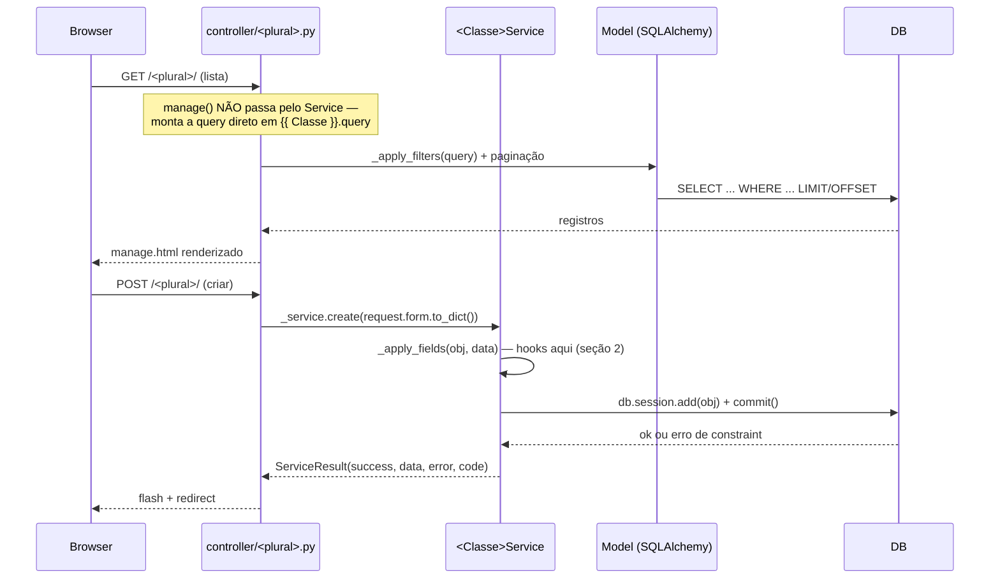

# 13 — CrudGen: Guia Operacional (Fluxo de Objetos, Hooks, Manutenção)

> **Status: REFERÊNCIA DESCRITIVA + guia prático.** Companheiro da
> skill 12 (que documenta *o que existe* — anotações, artefatos,
> `--overwrite`/`--only`). Esta skill documenta *como trabalhar* com
> uma entidade já gerada no dia a dia: por onde um objeto passa entre
> o request e a resposta, onde interceptar esse fluxo de verdade
> (achado importante: é bem mais restrito do que "hooks antes/depois
> de qualquer método" sugere — seção 2), como adicionar campo, e um
> cookbook das manutenções mais comuns.

---

## 1. Fluxo de objetos — do request à resposta

Existem **dois caminhos paralelos e independentes**, ambos
delegando pra mesma instância de `{{ Classe }}Service` — mas com uma
assimetria real que vale saber antes de debugar comportamento de
lista/filtro.

### 1.1 Caminho Web (HTML) — `controller/<plural>.py`



**Achado real, não óbvio**: `manage()` (a listagem) **não chama
`_service.list()`** — monta a query direto contra o model
(`{{ Classe }}.query`, com `_apply_filters()` aplicando busca/filtros).
`_service.list()` existe no Service mas só é usado pelo caminho API
(seção 1.2). Se você for customizar o comportamento de busca/filtro da
tela de lista, é em `_apply_filters()` (dentro do controller gerado)
que a lógica mora — não em `Service.list()`.

### 1.2 Caminho API (JSON) — `api/routes/<plural>_routes.py`

Mesmo `Service`, mesmos hooks — a diferença é só serialização
(JSON em vez de form-encoded/HTML) e o fato de `list_items()`/
`get_item()` **usarem** `_service.list()`/`_service.get_by_id()`
diretamente (sem a paginação/filtro por querystring que o caminho
Web tem — a API devolve a lista inteira de não-deletados, sem
paginação, hoje).

### 1.3 Onde cada ação passa pelo Service (resumo)

| Ação | Web (`controller/<plural>.py`) | API (`api/routes/<plural>_routes.py`) |
|---|---|---|
| Listar | **Não** — query direta no controller | **Sim** — `_service.list()` |
| Detalhe | Sim — `_service.get_by_id()` | Sim — `_service.get_by_id()` |
| Criar | Sim — `_service.create()` | Sim — `_service.create()` |
| Editar | Sim — `_service.update()` | Sim — `_service.update()` |
| Lixeira/Restaurar/Excluir | Sim — `_service.trash()`/`restore()`/`delete_permanent()` | Idem |

---

## 2. Hooks — onde interceptar de verdade

**Achado central desta skill**: existem hooks de lifecycle
"antes"/"depois" de verdade, mas **só em um lugar** — ao redor de
`_apply_fields()`, no Service, usado só por `create()` e `update()`.
Não existe hook de lifecycle em `list()`, `get_by_id()`, `trash()`,
`restore()`, `delete_permanent()`, nem em nenhum ponto do Controller
ou das Rotas API — nesses lugares, `*_hooks.py` serve só pra
**adicionar rota nova** (extensão por adição), não pra interceptar o
que já existe (extensão por interceptação).

### 2.1 Os 2 hooks reais (`<entidade>_service_hooks.py`)

```python
# services/malte_service_hooks.py — criado uma única vez, nunca sobrescrito

def pbo_apply_fields(obj, data: dict) -> dict | None:
    """
    Chamado ANTES de aplicar `data` nos atributos de `obj` — em
    create() (obj novo, obj.id is None) E em update() (obj existente,
    obj.id is not None). Retornar um dict SUBSTITUI `data` inteiro
    pro resto do fluxo — retornar None mantém `data` original.

    Uso típico: gerar valor derivado antes do save (ex.: SKU
    automático), normalizar formato, ou VALIDAR e sinalizar erro
    (levantando exceção — o try/except de create()/update() no
    service já captura e traduz pra ServiceResult de erro).
    """
    if obj.id is None:  # só em create — update não passa por aqui de novo
        data = dict(data)
        if not data.get("sku"):
            data["sku"] = _gerar_sku_automatico(data.get("nome", ""))
    return data


def pai_apply_fields(obj, data: dict) -> None:
    """
    Chamado DEPOIS de `data` já aplicado em `obj` (atributos já
    setados), ANTES do commit. Retorno ignorado — é só pra efeito
    colateral. `obj` já tem os valores novos, mas ainda não foi
    persistido — dá pra ajustar mais um campo calculado a partir de
    outros campos que acabaram de ser setados.

    Uso típico: campo derivado que depende de outro campo já setado
    (ex.: obj.volume_total = obj.largura * obj.altura), ou log de
    auditoria em memória (nunca I/O bloqueante aqui — ainda dentro da
    transação de commit).
    """
    pass
```

**Contrato exato** (mesma docstring que já vem no arquivo gerado,
`service_hooks.py.j2`):

| Hook | Quando roda | Parâmetros | Retorno |
|---|---|---|---|
| `pbo_apply_fields(obj, data)` | Início de `_apply_fields()` — antes do loop que seta atributos | `obj` (novo ou existente), `data` (dict cru vindo do form/JSON) | `dict` novo (substitui `data`) ou `None` (mantém original) |
| `pai_apply_fields(obj, data)` | Fim de `_apply_fields()` — depois do loop, antes de `updated_at` | `obj` (já com os campos aplicados), `data` (o mesmo dict usado no loop) | Ignorado — só efeito colateral |

**Como distinguir create de update dentro do hook**: `obj.id is None`
→ é create (objeto ainda não tem PK). `obj.id is not None` → é
update. Não existe `pbo_create`/`pbo_update` separados — é sempre o
mesmo par de hooks pros dois casos, essa checagem é o jeito de
diferenciar quando precisar.

**Se o hook não existir ou não estiver definido**: `_hook(name)` faz
fallback silencioso pra uma função `_noop` — nenhum erro, nenhum
efeito. Adicionar hook é sempre opcional, nunca quebra nada por
omissão.

### 2.2 O que `controller_hooks.py`/`routes_hooks.py` são de fato

Não têm nenhum ponto de interceptação — são arquivo em branco (mesmo
`"""Criado uma única vez, nunca sobrescrito."""`) onde você **adiciona
rota nova**, no mesmo Blueprint já criado no arquivo gerado. Padrão
real já usado no projeto (`brewfather_syncs_hooks.py`):

```python
# controller/brewfather_syncs_hooks.py
from addons.addon_brewstation.features.feature_brew_father.controller.brewfather_syncs import brewfather_syncs_bp

@brewfather_syncs_bp.route("/sincronizar", methods=["POST"])
@login_required
@permission_required("brewfather_syncs.create")
def sincronizar():
    ...
```

Isso não intercepta `create()`/`update()`/etc. do controller gerado —
é uma rota **nova**, `/brewstation/brewfather-syncs/sincronizar`,
convivendo no mesmo Blueprint. Se você precisa rodar lógica extra
*dentro* do fluxo padrão de criar/editar (não numa rota separada), o
lugar certo é `pbo_apply_fields`/`pai_apply_fields` no Service — não
o controller.

### 2.3 Quando NENHUM hook serve — e o que fazer

`trash()`, `restore()`, `delete_permanent()`, `list()`, `get_by_id()`
não têm ponto de hook nenhum hoje. Se precisar de lógica extra nesses
pontos (ex.: notificar algo quando um registro vai pra lixeira),
duas opções, nenhuma automática:
1. **Rota nova via `controller_hooks.py`**, chamando `_service.trash(id)`
   você mesmo e adicionando a lógica extra ao redor — mas aí é uma
   rota *separada* da `/​<id>/trash` gerada, não a mesma.
2. **Editar o `service.py` gerado diretamente** — perde a garantia de
   nunca ser sobrescrito (só hooks têm essa garantia), mas é uma opção
   real se o `--overwrite` daquela entidade específica não for mais
   necessário (decisão caso a caso, não uma regra geral).

Não existe hoje um jeito de adicionar hook novo em `trash()` sem
tocar no arquivo gerado — registrado como gap conhecido, não
resolvido nesta rodada.

---

## 3. Como adicionar um campo — checklist prático completo

Passo a passo real, na ordem que efetivamente evita retrabalho
(cada item existe porque pular ele causou problema real em algum
momento desta ou de sessões anteriores):

1. **Coluna no model** (`model/<entidade>.py`) — `nullable=False` se
   for obrigatório de verdade a nível de banco (isso trava no INSERT/
   UPDATE independente de qualquer outra camada).
2. **`@required`/`@max_length`/`@min_length`/`@min_value`** (skill 12
   §2.2), se quiser HTML5 nativo + `FieldRule` semeada — **opcional**,
   independente do `nullable=False` do passo 1 (uma coisa não implica
   a outra; um campo pode ser `nullable=False` sem anotação, e nesse
   caso só o banco reclama, sem mensagem amigável na tela).
3. **`to_dict()`** do model — se o model tiver um método manual (nem
   todo model tem, mas quando tem, campo novo não aparece em resposta
   de API/JSON sem isso).
4. **Regenerar ou não**:
   - Controller/templates seguem o padrão genérico (introspecção de
     `__table__.columns`) → campo novo aparece sozinho no próximo
     boot, **sem regenerar nada**.
   - Só regenera (`--overwrite`, ou `--overwrite --only templates` se
     só as telas precisarem mudar) se quiser que uma anotação nova
     (`@required`, `@weak_ref`, `@choices`) passe a ter efeito nas
     telas — anotação sozinha, sem regenerar, não muda HTML já
     gerado (skill 12 §3).
5. **Migration**, se a tabela já tem dado real (`flask db migrate` +
   `flask db upgrade`) — `db.create_all()` nunca faz `ALTER TABLE`.
   Campo novo `nullable=False` numa tabela com linha existente precisa
   de valor de backfill decidido *antes* de escrever a migration (não
   um detalhe técnico pra resolver na hora — ver exemplo real: a
   ampliação de `Material` resolveu isso com registros seed em vez de
   valor fixo).
6. **Services que constroem a entidade manualmente** fora do fluxo
   HTTP padrão (ex.: um `*_autocreate_service.py`, um hook de outro
   módulo que faz `Entidade(campo=...)` direto) — cada um desses
   precisa decidir um valor pro campo novo, senão quebra em runtime
   assim que o campo virar `nullable=False`. Achar todos: `grep -rn
   "NomeDaClasse("` no projeto, não só nos arquivos gerados.
7. **Ripple effect nos testes** — toda instanciação direta do model
   em `tests/*.py` que passar a violar a constraint nova. Mesmo
   comando de grep do passo 6, escopado a `tests/`.
8. **Docs**: `docs/technical/04-modelo-de-dados.md` da escala certa —
   coluna nova no diagrama `erDiagram` + linha na tabela de descrição
   se tiver regra de negócio não óbvia.

---

## 4. Cookbook — manutenções comuns

**Mudar o campo usado na busca da lista** (`?q=...`): `_SUMMARY_FIELD_PRIORITY`
no controller gerado prioriza `name`/`label_text`/`title`/`username`,
nessa ordem — se o campo certo não estiver nessa lista, cai no
primeiro campo editável (pode não ser o que você quer). Regenerar não
resolve isso automaticamente; é um `--overwrite` do controller com a
prioridade certa, ou editar o controller gerado direto.

**Adicionar filtro novo na lista**: `@choices(campo)` no model (vira
`<select>` automaticamente, valores `DISTINCT` do banco) — pra campo
booleano, já vira filtro Sim/Não sozinho, sem anotação (introspecção
de tipo). Pra filtro mais complexo que isso (range de data, múltipla
escolha), precisa editar `_apply_filters()` no controller gerado à
mão — não tem anotação pra isso hoje.

**Customizar a mensagem de erro de constraint do banco**: `_friendly_db_error()`
no `service.py.j2` já traduz `UNIQUE constraint failed` e `FOREIGN KEY`
genericamente. Pra uma mensagem específica de um campo (ex.: "SKU já
cadastrado" em vez do genérico "Já existe um registro com este valor
no campo 'sku'"), a checagem de unicidade **antes** do commit (dentro
de `pbo_apply_fields`, levantando uma exceção com a mensagem
específica) é o lugar — o hook roda antes do `db.session.commit()`
tentar e falhar.

**Resolver referência fraca em nome legível**: `@weak_ref` (skill 11/12)
— não é hook, é anotação, ver skill 12 §2.3/§4.

**Adicionar uma ação de negócio que não é CRUD** (ex.: "recalcular",
"sincronizar", "aprovar em lote"): rota nova via `controller_hooks.py`/
`routes_hooks.py` (seção 2.2 acima), não um hook de lifecycle —
exemplo real no projeto: `yeast_bank_viability.py`
(`feature_yeast_bank`), Blueprint próprio fora do padrão CrudGen.

---

## 5. Erros comuns / debugging

- **Campo boolean chegando como `TypeError: Not a boolean value: 'true'`**:
  só acontece se `_coerce_value()` não rodou — checar se o campo está
  em `_EDITABLE_FIELDS` (colunas `id`/`created_at`/`updated_at`/
  `is_deleted`/`deleted_at` são excluídas de propósito, skill 12).
  Via API JSON isso não acontece (o JSON já manda `true`/`false`
  tipado) — só via formulário HTML, que manda tudo como string.
- **Hook não está rodando**: confirmar que o nome da função é
  exatamente `pbo_apply_fields`/`pai_apply_fields` (sem typo) — nome
  errado não dá erro nenhum, só cai no `_noop` silenciosamente
  (`_hook()` usa `getattr(_hooks, name, _noop)`).
- **Campo `@required` sem badge/HTML5 na tela**: precisa regenerar
  (`--overwrite --only templates` basta, não precisa regenerar tudo)
  — anotação sozinha não retroage sobre HTML já gerado.
