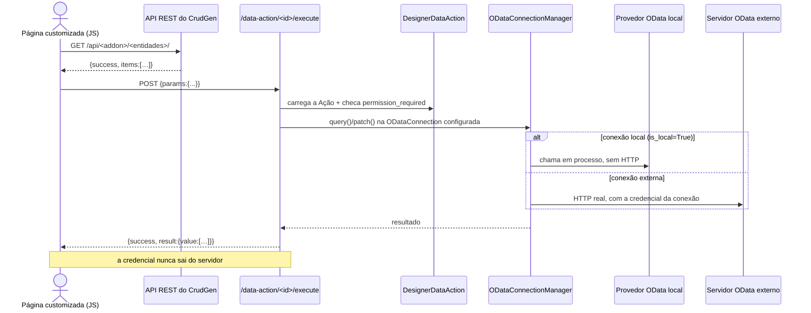

# 17 — Páginas Customizadas: fluxo de consumo de dados

> **Status: EXECUTADA (Fase 12).** Descreve como uma página customizada
> (`/admin/designer/`) consome dado do Tesseract. Complementa a skill 16,
> cujas seções sobre o construtor visual são histórico — o construtor foi
> removido; a página é HTML escrito à mão.
>
> Modelos prontos, na mesma pasta dos HTMLs de referência do NiceAdmin:
> - `static/modelo_paginas_nice_admin/_modelo-pagina-basico.html`
> - `static/modelo_paginas_nice_admin/_modelo-pagina-completo.html`

---

## 1. O que a página é (e o que não é)

`DesignerPage.content_html` é um **fragmento HTML** inserido dentro do
layout do sistema. Bootstrap 5, Bootstrap Icons e o tema já estão
carregados — não escreva `<html>`, `<head>` nem `<body>`.

**Não é template Jinja.** O conteúdo é renderizado com `|safe`, nunca
por `render_template_string()`. Renderizar Jinja vindo do banco é
injeção de template (SSTI) — na prática, execução de código no
servidor, mesmo restrito a admin. Escrever `{{ 7 * 191 }}` na página
mostra o texto literal, não `1337` (há teste cobrindo isso). Todo dado
dinâmico entra por JavaScript, pelos caminhos da seção 2.

**Não tem componentes.** Não existe paleta, canvas nem árvore — isso
foi removido na Fase 12 (skill 16, cabeçalho).

---

## 2. Os três caminhos de dado

| Caminho | Endpoint | Retorno | Permissão | Use quando |
|---|---|---|---|---|
| **API REST do CrudGen** | `/api/<addon>/<entidades>/` | `{success, items:[…]}` / `{success, item:{…}}` | `<plural>.list`, `.detail`, `.create`, `.update`, `.trash`, `.restore`, `.delete` | O dado é de uma entidade gerada pelo CrudGen e você quer CRUD completo |
| **Ação de Dado** | `POST /admin/designer/data-action/<id>/execute` | `{success, result:{value:[…], "@odata.count":N}}` | a da própria `DesignerDataAction` (`NULL` = qualquer logado) | O dado vem de fora (OData externo), ou você quer `$filter`/`$top` resolvidos no servidor |
| **Opções de combo** | `GET /api/options/<plural>?search=&page=&value_field=` | lista paginada | login | Popular `<select>` — mesmo endpoint dos combos de referência fraca do CrudGen |

### Regra de escolha

Entidade local do CrudGen e você precisa criar/editar/excluir → **API
REST**. Dado externo, ou consulta que não deve ser montada no navegador
→ **Ação de Dado**. Combo → **`/api/options/`**.

A Ação de Dado **não substitui** a API REST para entidade local: ela só
suporta `query` e `update` (`create`/`delete` devolvem `501` — o
schema prevê, o motor de execução ainda não implementa).

---

## 3. Fluxo completo



---

## 4. Contratos

### API REST do CrudGen

```
GET    /api/<addon>/<entidades>/          → {success:true, items:[{…}]}
GET    /api/<addon>/<entidades>/<id>      → {success:true, item:{…}}
POST   /api/<addon>/<entidades>/          → cria      (corpo JSON)
PUT    /api/<addon>/<entidades>/<id>      → atualiza  (corpo JSON)
POST   /api/<addon>/<entidades>/<id>/trash    → soft-delete
POST   /api/<addon>/<entidades>/<id>/restore  → desfaz o soft-delete
DELETE /api/<addon>/<entidades>/<id>      → exclusão definitiva
```

Erro sempre no formato `{success:false, error:"…"}`.

### Ação de Dado

```jsonc
// requisição
{ "params": { "$filter": "status eq 'disponivel'", "$top": 50, "$orderby": "name asc" } }
// para operation="update":
{ "key": "42", "payload": { "name": "Novo nome" } }
```

`static_params` da Ação são aplicados sempre e os `params` da
requisição são mesclados por cima.

**`$filter` do provedor local é mínimo de propósito**: só
`campo eq valor`, várias condições unidas por ` and `. Não há `gt`,
`lt`, `or` nem funções — cresce quando um caso real pedir, em vez de
implementar especulativamente. Contra servidor OData externo, vale o
que o servidor suportar.

---

## 5. Permissão e sessão

Todos os caminhos exigem sessão. Vale distinguir os dois códigos, porque
a saída é diferente:

- **401** — sessão expirou. Recarregar a página resolve.
- **403** — falta permissão. Recarregar não resolve nunca; mostre a
  mensagem e pare.

Uma página pode ter `permission_required` própria
(`DesignerPage.permission_required`), checada antes de renderizar. Isso é
independente da permissão de cada chamada de dado dentro dela — uma
página aberta pode conter uma chamada que o usuário não pode fazer.

---

## 6. Segurança

**O HTML da página é confiável; o dado que volta da API não é.** O
conteúdo é escrito por um admin, então renderizá-lo com `|safe` é
aceitável. Mas o *conteúdo dos registros* vem de qualquer usuário que
tenha cadastrado algo — um nome com `<script>` vira XSS se for jogado
direto no `innerHTML`. Sempre escape:

```js
const esc = (v) => v == null ? '' : String(v).replace(/[&<>"']/g, c =>
  ({'&':'&amp;','<':'&lt;','>':'&gt;','"':'&quot;',"'":'&#39;'}[c]));
```

O helper `TesseractData.esc()` do modelo completo já faz isso.

**A Ação de Dado roda no servidor** justamente porque a `ODataConnection`
pode ter credencial (`auth_value`). Nunca chame um provedor OData
externo direto do navegador para contornar isso.

**CSRF**: o projeto não tem `CSRFProtect` instalado hoje, então `fetch`
com JSON funciona sem token. Se um dia CSRF for ativado, todas as
chamadas `POST`/`PUT`/`DELETE` das páginas customizadas passam a exigir
o token — este é o ponto que quebraria em silêncio, e por isso está
registrado aqui.

---

## 7. Erros comuns

| Sintoma | Causa provável |
|---|---|
| `404` na Ação de Dado | O id não existe. Os ids ficam listados no painel lateral do editor. |
| `501` na Ação de Dado | `operation` é `create` ou `delete` — não implementados. Use a API REST. |
| `Entidade '…' não exposta pelo provedor local` | Falta `@odata_expose` no model (opt-in por entidade — skill 16, seção 3). |
| `502` na Ação de Dado | Servidor OData externo fora do ar ou credencial inválida. |
| `{{ … }}` aparece literal na página | Comportamento correto: o conteúdo não é Jinja (seção 1). |
| Dado não aparece e o console mostra erro de parse | A rota devolveu HTML (tela de login) em vez de JSON — sessão expirada. |

---

## 8. Regra de ouro desta skill

> Dado dinâmico em página customizada entra **sempre** por JavaScript
> chamando um dos três caminhos da seção 2 — nunca por template
> renderizado no servidor a partir do banco. E todo valor vindo do
> servidor passa por `esc()` antes de tocar o `innerHTML`.
