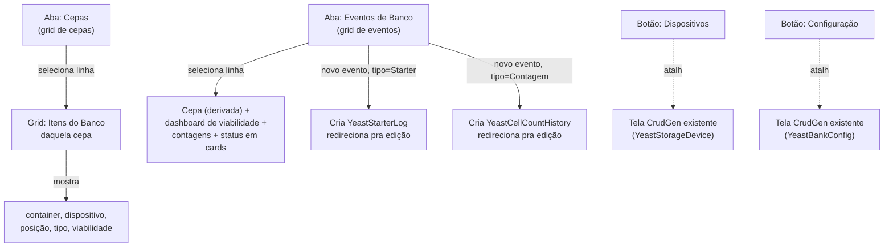

# 21 — Proposta: Tela integrada de navegação + unificação Evento/Starter/Contagem

> **Status: seções 1–2 [EXECUTADO] (2026-08-24), seção 0 (tela em si)
> ainda [DECIDIDO], pendente de implementação.** Fecha o item 2 da
> sequência definida pelo Christopher (BACKLOG, após as Fases 14–19).
> Convenção de status igual às skills 05/19 — **[DECIDIDO]** fechado e
> pronto pra executar quando autorizado, **[EXECUTADO]** já no código,
> **[ABERTO]** ainda sem decisão.
>
> A unificação de schema/fluxo (seções 1 e 2 — `YeastBankEvent` como
> ponto de entrada único, remoção de `YeastStorageReading`, hooks de
> controller reais) está implementada e testada (BACKLOG, Fase 20). A
> tela integrada em si (2 abas + botões, seção 0/3) é a próxima fase,
> de frontend — ainda não iniciada.

---

## 0. Decisão raiz

**[DECIDIDO]** Uma tela nova (fora do padrão CrudGen — mesma decisão
já anunciada quando a Fase 14 foi planejada) consolida a navegação do
Yeast Bank em 2 abas, com botões de atalho pras telas que continuam
CrudGen puro:

```
┌─────────────────────────────────────────────────────┐
│  [Dispositivos de Armazenamento]  [Configuração]     │  ← botões, telas CrudGen existentes
├─────────────────────────────────────────────────────┤
│  [ Cepas ]  [ Eventos de Banco ]                     │  ← abas
└─────────────────────────────────────────────────────┘
```

- **Botões** (não viram aba, só atalho pra tela já existente):
  `YeastStorageDevice` (Dispositivos) e `YeastBankConfig`
  (Configuração — prazos/decaimento/alerta por tipo de armazenamento,
  já implementada na Fase 19).
- **Aba "Cepas"**: grid de cepas. Selecionar uma linha preenche
  grid(s) relacionadas com os Itens do Banco daquela cepa — container,
  dispositivo, posição, tipo de armazenamento, viabilidade estimada,
  status.
- **Aba "Eventos de Banco"**: grid de eventos. Selecionar uma linha
  permite ver a cepa (derivada, não mais campo de escolha — seção 2),
  viabilidade como dashboard, contagens de célula, com status em
  cards.

## 1. Unificação Evento / Starter / Contagem

**[DECIDIDO]** `YeastBankEvent` vira o **ponto de entrada único** —
todo evento nasce ali. Quando o tipo exige campos especializados, o
evento cria automaticamente o registro na tabela especializada e
redireciona a pessoa pra lá:

| `event_type` | Ao criar o evento |
|---|---|
| **Starter** | Cria linha em `YeastStarterLog` vinculada, redireciona pra edição do Starter |
| **Contagem de Células** | Cria linha em `YeastCellCountHistory` vinculada, redireciona pra edição da Contagem |
| **Descarte** | Fica no próprio evento (`status_before`/`status_after`/`notes`), sem tabela extra |
| **Outro** | Idem — só o evento em si |

Isso não é fusão total (Starter e Contagem continuam com campos
próprios demais pra virar coluna solta em `bank_event`) nem só "mais
linkado" — é o ponto de entrada único com redirecionamento automático,
o meio-termo que o Christopher definiu.

### 1.1 Schema — `YeastBankEvent`

| Campo | Mudança |
|---|---|
| `bank_item_id` | Passa a ser **obrigatório** (`NOT NULL`) — hoje é opcional |
| `strain_id` | **Removido** — cepa é sempre resolvida via `bank_item.strain`, nunca mais campo de escolha |
| `starter_id` | Continua existindo, mas deixa de ser **editável pela pessoa** — só o próprio fluxo de criação (`event_type="Starter"`) preenche, apontando pro `YeastStarterLog` que ele acabou de criar |
| `cell_count_id` | **Novo** — mesmo papel do `starter_id` acima, mas apontando pro `YeastCellCountHistory` criado quando `event_type="Contagem de Células"` |
| `event_type` | Passa a ter catálogo fechado via `@enum_field`: `Starter` / `Contagem de Células` / `Descarte` / `Outro` (hoje é texto livre) |
| `status_before` / `status_after` / `notes` | Sem mudança |

### 1.2 Schema — `YeastCellCountHistory`

| Campo | Mudança |
|---|---|
| `bank_item_id` | Passa a ser **obrigatório** — hoje é opcional |
| `strain_id` | **Removido** — resolvido via `bank_item.strain` |
| `starter_id` | **Removido** — decisão do Christopher: contagem é sempre do item, sem distinguir se veio de um starter específico |
| Todo o resto (`sample_date`, `cells_per_ml`, `viability_percent`, etc.) | Sem mudança |

### 1.3 Schema — `YeastStarterLog`

Sem mudança de campo — já tinha só `bank_item_id` (obrigatório, com
`@weak_ref`), nunca teve `strain_id` solto. Muda só o **fluxo de
criação** (seção 1.4).

### 1.4 [ABERTO] Fluxo de criação do Starter — confirmar antes de implementar

O Christopher descreveu: *"Pode criar um starter desde que seja via
evento de banco"*. Duas leituras possíveis, com impacto real no que eu
vou construir:

- **A.** A tela própria de Starter (`/brewstation/yeast-starter-logs/`)
  perde o botão/rota de **criar** — só edição/consulta de starters já
  existentes continua ali. Toda criação nova passa exclusivamente pelo
  fluxo de Evento de Banco.
- **B.** As duas portas continuam abertas — criar direto na tela de
  Starter continua funcionando (sem gerar Evento associado), e criar
  via Evento de Banco é só um atalho a mais, não o único caminho.

Vou implementar como **A** (fecha a criação direta, força passar pelo
Evento) a menos que o Christopher confirme **B** — é a leitura mais
literal de "desde que seja via evento de banco".

## 2. `YeastStorageReading` — removida

**[DECIDIDO]** Tabela, model, CRUD e menu removidos por completo.
Christopher: *"seria útil em etapa de fermentação, não é o caso aqui"*
— confirma que não é um recorte por preguiça, é avaliação real de que
o histórico de temperatura solto não serve pro Yeast Bank (o
`YeastStorageDevice` já mantém `current_temperature_c`/
`last_temperature_at` como cache do último valor, isso permanece).

## 3. Navegação da tela nova — mapa



## 4. Documentação exigida (Christopher pediu explicitamente)

*"isso tem der ser documentado no manual e nos fluxos"* — dois
documentos tocados na implementação, não é opcional:

- `docs/manual/03-funcionalidades.md` (feature_yeast_bank) — a seção
  de Eventos/Starter/Contagem precisa refletir o fluxo novo (criar
  evento tipo Starter → cai na tela de Starter), em linguagem não
  técnica, sem citar nome de tabela.
- `docs/technical/03-fluxos.md` (feature_yeast_bank) — sequência
  técnica do redirecionamento automático (evento → cria registro
  especializado → redireciona), pro trilho técnico.
- `docs/technical/04-modelo-de-dados.md` — schema atualizado das 3
  entidades (seção 1.1–1.3 acima) e remoção de `YeastStorageReading`.

## 5. O que fica pra depois (fora desta skill)

- Item 3 da sequência do Christopher (reanálise de alerta automático
  de `YeastBankConfig` + geração automática de `YeastBankEvent` a
  partir de mudança real noutros services) — continua por último,
  como combinado. A infraestrutura desta skill (Evento como ponto de
  entrada único) deixa esse trabalho futuro mais natural, mas não o
  antecipa.
- Dashboard de viabilidade da aba "Eventos de Banco" (seção 0) — o
  desenho visual exato (quais cards, quais gráficos) não foi
  detalhado ainda; entra na etapa de implementação da tela em si,
  não é uma decisão de schema.
