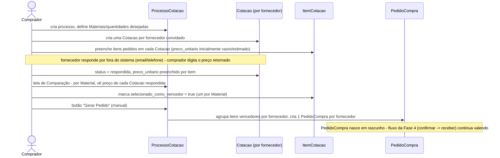

# 24 — Proposta: Sistema de Cotação (RFQ) — Addon Estoque

> **Status: [DECIDIDO] — aguardando execução.** Continuação direta da
> skill 23 (Fases 1–5, todas entregues) — o item "Vamos planejar
> depois um sistema de cotação" ficou registrado no BACKLOG como
> decisão futura; esta skill formaliza esse planejamento. Convenção de
> status igual às skills 05/23: **[DECIDIDO]** fechado, pronto pra
> executar. **[EXECUTADO]** já no código. **[ABERTO]** sem decisão.

---

## 0. Motivação e referência

Inspirado no fluxo de RFQ (Request for Quotation) do SAP MM: uma
cotação é enviada a **múltiplos fornecedores em paralelo** pro mesmo
processo de compra — cada fornecedor responde com seu próprio
documento (mesma estrutura de um Pedido de Compra: cabeçalho + itens),
todos ligados por um número de "cotação coletiva" pra comparação. Após
comparar preço/prazo por item, as linhas vencedoras (podendo estar
divididas entre fornecedores diferentes) viram Pedido(s) de Compra.

Decisão raiz herdada da skill 23: **tudo dentro do próprio
`addon_estoque`**, sem Addon novo — mesmo raciocínio (volume pequeno,
FK real mais simples que referência fraca entre Addons).

---

## 1. Decisões de sessão

**[DECIDIDO]** Estrutura: um cabeçalho de `Cotacao` **por fornecedor**
convidado, agrupados por um `ProcessoCotacao` comum (não um cabeçalho
único com N fornecedores dentro) — mesmo padrão SAP.

**[DECIDIDO]** Comparação é **por item**, não por cotação inteira — o
processo pode fechar com Malte do Fornecedor A e Lúpulo do Fornecedor
B na mesma rodada.

**[DECIDIDO]** Conversão pra Pedido de Compra é **manual** (botão
"Gerar Pedido", ação separada) — nunca automática ao marcar um item
como vencedor. Dá pra revisar antes de confirmar.

**[DECIDIDO]** `Cotacao`/`ItemCotacao` **não têm tela CRUD própria**
(mesma decisão da Fase 5) — API REST existe, a tela é o detalhe do
`ProcessoCotacao` desenhado com abas/grid, e a comparação é uma tela
própria desenhada.

---

## 2. Modelagem

```
ProcessoCotacao          (tesseract_estoque_processo_cotacao)
├── numero (auto, COT-000001), descricao, status, data_abertura,
│   data_limite_resposta, observacoes
│
└── Cotacao               (tesseract_estoque_cotacao)
    ├── processo_cotacao_id FK, fornecedor_id FK, numero (auto)
    ├── status (rascunho/enviada/respondida/recusada)
    ├── condicao_pagamento, prazo_entrega_dias, observacoes
    │
    └── ItemCotacao        (tesseract_estoque_item_cotacao)
        ├── cotacao_id FK, material_id FK, material_unidade_id FK
        ├── quantidade, preco_unitario
        ├── fator_conversao_aplicado / quantidade_convertida_base /
        │   subtotal — calculados no hook, mesmo padrão de
        │   ItemPedidoCompra (skill 23, Fase 4)
        └── selecionado_como_vencedor (bool, default false)
```

### `ProcessoCotacao` (`tesseract_estoque_processo_cotacao`)

| Coluna | Tipo | Obrigatória | Observação |
|---|---|---|---|
| `id` | Integer, PK | Sim | |
| `numero` | String(30), unique | Não | Auto (`COT-000001`), mesmo padrão de `PedidoCompra.numero` (hook, editável depois) |
| `descricao` | String(200) | Sim | Ex.: "Cotação Malte Pilsen — Safra 2026" |
| `status` | `@enum_field` (`aberto` / `comparado` / `finalizado` / `cancelado`) | Sim, default `aberto` | `finalizado` = já gerou todos os Pedidos de Compra pretendidos; não bloqueia gerar mais depois se sobrar item sem vencedor |
| `data_abertura` | Date | Sim | |
| `data_limite_resposta` | Date | Não | |
| `observacoes` | Text | Não | |
| + soft-delete/timestamps padrão | | | |

### `Cotacao` (`tesseract_estoque_cotacao`)

| Coluna | Tipo | Obrigatória | Observação |
|---|---|---|---|
| `id` | Integer, PK | Sim | |
| `processo_cotacao_id` | FK → `processo_cotacao.id` (CASCADE) | Sim | |
| `fornecedor_id` | FK → `fornecedor.id` (RESTRICT) | Sim | |
| `numero` | String(30), unique | Não | Auto (`COT-000001-A`, sufixo por fornecedor — ver seção 4) |
| `status` | `@enum_field` (`rascunho` / `enviada` / `respondida` / `recusada`) | Sim, default `rascunho` | |
| `condicao_pagamento` | String(100) | Não | |
| `prazo_entrega_dias` | Integer | Não | |
| `observacoes` | Text | Não | |
| + soft-delete/timestamps padrão | | | |

Índice único parcial: no máximo uma `Cotacao` não-deletada por
`(processo_cotacao_id, fornecedor_id)` — não faz sentido convidar o
mesmo fornecedor duas vezes no mesmo processo.

### `ItemCotacao` (`tesseract_estoque_item_cotacao`)

| Coluna | Tipo | Obrigatória | Observação |
|---|---|---|---|
| `id` | Integer, PK | Sim | |
| `cotacao_id` | FK → `cotacao.id` (CASCADE) | Sim | |
| `material_id` | FK → `material.id` (RESTRICT) | Sim | |
| `material_unidade_id` | FK → `material_unidade.id` (RESTRICT) | Sim | |
| `quantidade` | Float | Sim | Na unidade de compra, mesmo raciocínio de `ItemPedidoCompra` |
| `fator_conversao_aplicado` | Float | Calculado (hook) | Snapshot |
| `quantidade_convertida_base` | Float | Calculado (hook) | |
| `preco_unitario` | Float | Sim | |
| `subtotal` | Float | Calculado (hook) | |
| `selecionado_como_vencedor` | Boolean, default `false` | Sim | Setado pela tela de comparação (ação dedicada, não edição direta do campo) |
| + soft-delete/timestamps padrão | | | |

**Regra de vencedor único por Material**: no máximo um
`ItemCotacao.selecionado_como_vencedor = true` por
`(processo_cotacao_id, material_id)` — atravessa `Cotacao`
(fornecedores diferentes), então **não dá pra ser índice único de
banco** (índice único só enxerga colunas da própria tabela +
join implícito não existe em constraint). Validado na ação de
seleção (service), não em constraint — documentado aqui pra não ser
esquecido numa migration futura achando que "faltou o índice".

---

## 3. Fluxo (preparação pra `docs/technical/03-fluxos.md` quando formalizado)



---

## 4. Numeração da `Cotacao` (achado a decidir na implementação)

`Cotacao.numero` precisa ser único mas relacionado ao
`ProcessoCotacao` pai — proposta: `{numero_do_processo}-{sufixo_letra}`
(ex.: processo `COT-000001` gera cotações `COT-000001-A`,
`COT-000001-B`, uma por fornecedor, na ordem de criação). Calculado no
hook de `Cotacao` (mesmo mecanismo de `PedidoCompra.numero`), lendo o
número do `ProcessoCotacao` pai + contando quantas `Cotacao` já
existem naquele processo.

---

## 5. Telas (mesmo padrão desenhado da Fase 5 — skill 23, seção 8)

- **`ProcessoCotacao`**: tela de lista simples (CrudGen) + detalhe com
  abas — Cabeçalho / Cotações (grid de `Cotacao` por fornecedor,
  adicionar convite em modal) / Comparação (grid por Material, uma
  linha por Cotacao que cotou aquele Material, botão "Selecionar como
  vencedor" por linha) / ação "Gerar Pedido".
- **`Cotacao`/`ItemCotacao`**: sem tela própria — API REST só,
  consumida pela aba "Cotações" (visão resumida) e por uma tela de
  detalhe de Cotacao específica (abre a partir do grid) pra editar os
  itens daquela cotação (grid de Itens, mesmo padrão de
  `ItemPedidoCompra` na Fase 5 — busca de Material, unidade
  dependente).

---

## 6. Plano de execução (ordem)

| Fase | Entrega | Depende de |
|---|---|---|
| 6.1 | `ProcessoCotacao`/`Cotacao`/`ItemCotacao` — models, migration, CrudGen básico, numeração automática, cálculo de subtotal/fator (hooks) — **[EXECUTADO]** | Fase 4 (usa `Fornecedor`/`MaterialUnidade`) |
| 6.2 | Tela de Comparação (desenhada, grid Material × Cotacao) + ação "selecionar vencedor" (valida único vencedor por Material) — **[EXECUTADO]** | 6.1 |
| 6.3 | Ação "Gerar Pedido" (agrupa vencedores por fornecedor → cria `PedidoCompra`/`ItemPedidoCompra`) | 6.2, Fase 4 |

Cada fase entra em patch separado, mesmo fluxo já validado (proposta →
autorização → migration com FK conferida à mão → testes → `git am
--keep-cr` em clone limpo → entrega).
