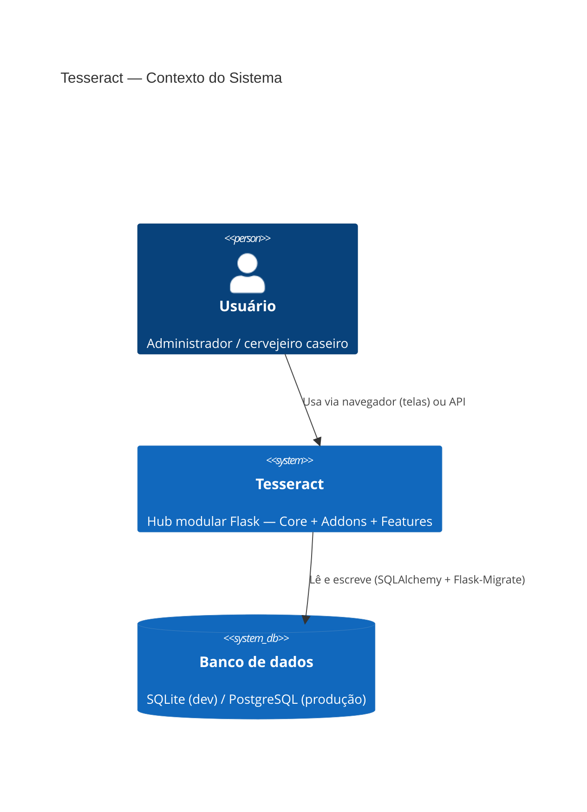
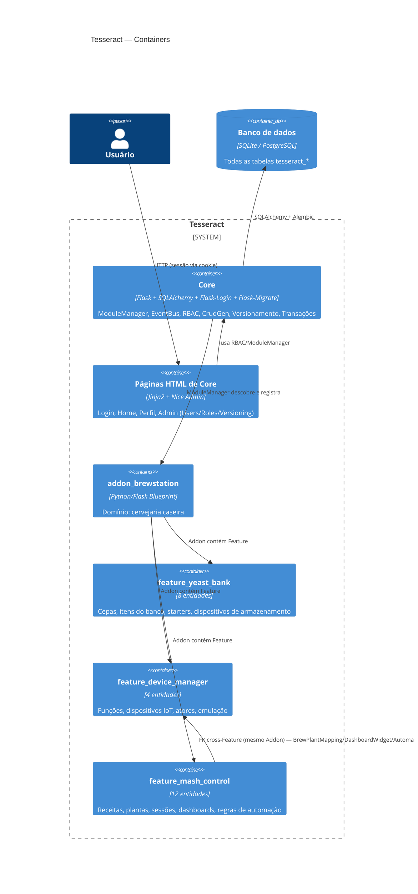
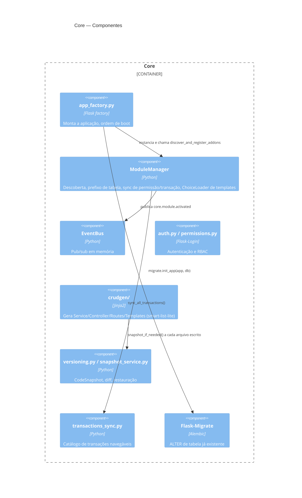

# 02 — Diagrama C4 (Sistema)

## Nível 1 — Contexto

Atores externos futuros (ainda não integrados): API do BrewFather,
broker MQTT (`device_manager`), Telegram — entram nas Fases 7c/8 e na
reescrita de `integ_bfather`.

## Nível 2 — Container

## Nível 3 — Componente (dentro do Core)

No nível Addon/Feature, gera-se só Componente quando a complexidade
interna justificar — o Container já foi coberto aqui.
