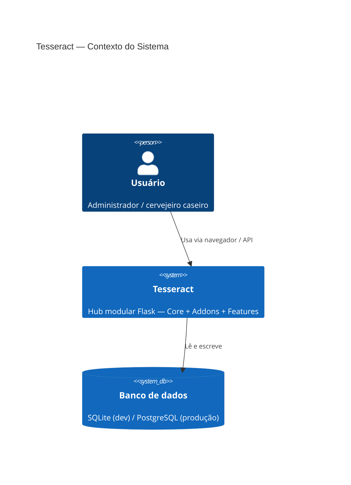
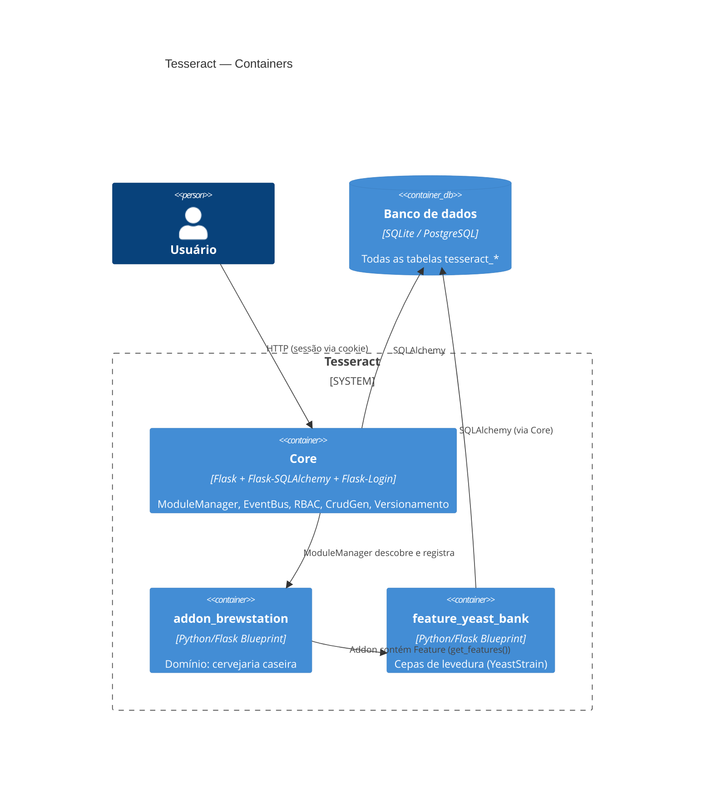
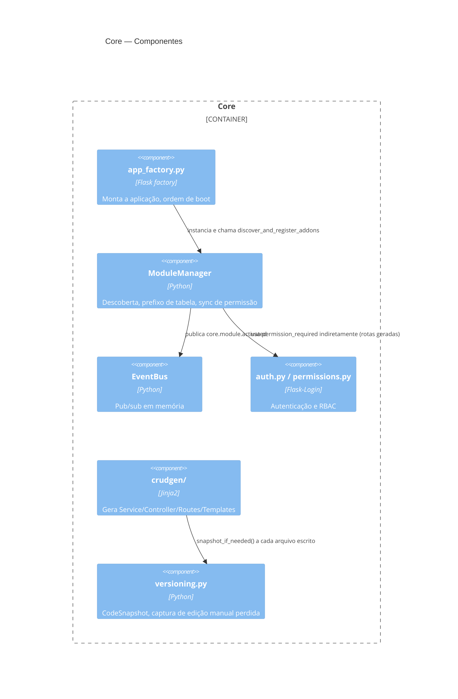

# 02 — Diagrama C4 (Sistema)

## Nível 1 — Contexto

Atores externos futuros (ainda não integrados): API do BrewFather,
broker MQTT (device_manager), Telegram (notificações) — entram nas
Fases 6+.

## Nível 2 — Container

## Nível 3 — Componente (dentro do Core)

No nível Addon/Feature (`addons/addon_brewstation/docs/technical/
02-diagrama-c4.md`, a criar quando houver componente interno
suficientemente complexo para justificar), gera-se só Componente — o
Container já foi coberto aqui.
