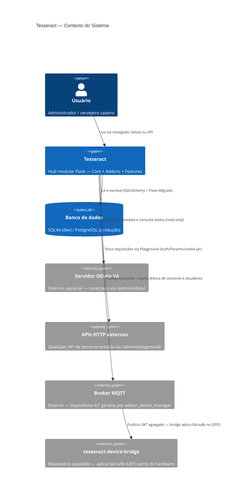
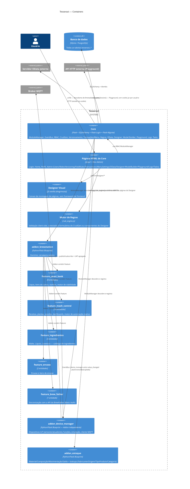

# 02 — Diagrama C4 (Sistema)

## Nível 1 — Contexto

```mermaid
C4Context
    title Tesseract — Contexto do Sistema

    Person(user, "Usuário", "Administrador / cervejeiro caseiro")
    System(tesseract, "Tesseract", "Hub modular Flask — Core + Addons + Features")
    SystemDb(db, "Banco de dados", "SQLite (dev) / PostgreSQL (produção)")
    System_Ext(odata, "Servidor OData V4", "Externo, opcional — conectado via /admin/odata/")
    System_Ext(httpext, "APIs HTTP externas", "Qualquer API de terceiros testada via /admin/playground/")
    System_Ext(mqtt, "Broker MQTT", "Externo — dispositivos IoT geridos por addon_device_manager")
    System_Ext(bridge, "tesseract-device-bridge", "Repositório separado — aplica fail-safe (LWT) perto do hardware")

    Rel(user, tesseract, "Usa via navegador (telas) ou API")
    Rel(tesseract, db, "Lê e escreve (SQLAlchemy + Flask-Migrate)")
    Rel(tesseract, odata, "Descobre metadata e consulta dados (read-only)")
    Rel(tesseract, httpext, "Testa requisições via Playground (Auth/Params/cookie jar)")
    Rel(tesseract, mqtt, "Publica comando / assina leitura de sensores e atuadores")
    Rel(mqtt, bridge, "Publica LWT agregado — bridge aplica fail-safe no GPIO")
```

Ator externo ainda não integrado: API do BrewFather via Telegram
(`integ_bfather` aguarda reescrita dedicada — `feature_brew_father`
hoje só faz o CRUD de sincronização, sem o notificador).

## Nível 2 — Container

```mermaid
C4Container
    title Tesseract — Containers

    Person(user, "Usuário")

    System_Boundary(tesseract, "Tesseract") {
        Container(core, "Core", "Flask + SQLAlchemy + Flask-Login + Flask-Migrate", "ModuleManager, EventBus, RBAC, CrudGen, Versionamento, Transações/Menu, Regras, OData, Designer, Model Builder, Playground, Logs, Tasks")
        Container(corepages, "Páginas HTML de Core", "Jinja2 + Nice Admin", "Login, Home, Perfil, Admin (Users/Roles/Versioning/FieldRules/Transactions/MenuSettings/OData/Designer/ModelBuilder/Playground/Logs/Tasks)")
        Container(designer, "Designer Visual", "JS vanilla (drag/resize)", "Canvas de montagem de páginas, sem framework de frontend")
        Container(rules, "Motor de Regras", "rule_engine.js", "Validação client-side, conectada a formulários do CrudGen e a componentes do Designer")

        Container(brewstation, "addon_brewstation", "Python/Flask Blueprint", "Domínio: cervejaria caseira")
        Container(yeastbank, "feature_yeast_bank", "8 entidades", "Cepas, itens do banco, starters, motor de viabilidade")
        Container(mashcontrol, "feature_mash_control", "18 entidades", "Receitas, plantas, sessões, dashboards, motor de automação reativo")
        Container(ingredientes, "feature_ingredientes", "3 entidades", "Malte, Lúpulo, Levedura — catálogo de ingredientes")
        Container(envase, "feature_envase", "2 entidades", "Envase e itens de envase")
        Container(brewfather, "feature_brew_father", "1 entidade", "Sincronização com a API do BrewFather (Basic Auth)")

        Container(devicemanager, "addon_device_manager", "Python/Flask Blueprint — Addon independente", "Dispositivos IoT (sensores/atuadores), funções, emulação, cliente MQTT")
        Container(estoque, "addon_estoque", "Python/Flask Blueprint", "Material/Composição/Movimentação/Saldo + lookups (Fabricante/Origem/TipoProduto/Categoria)")
    }

    ContainerDb(db, "Banco de dados", "SQLite / PostgreSQL", "Todas as tabelas tesseract_*")
    System_Ext(odataext, "Servidor OData externo")
    System_Ext(httpext, "API HTTP externa (Playground)")
    System_Ext(mqttext, "Broker MQTT")

    Rel(user, corepages, "HTTP (sessão via cookie)")
    Rel(corepages, core, "usa RBAC/ModuleManager")
    Rel(corepages, designer, "/admin/designer/*")
    Rel(corepages, rules, "carrega rule_engine.js em formulários e páginas do Designer")
    Rel(core, brewstation, "ModuleManager descobre e registra (auto-descoberta, skill 09)")
    Rel(core, devicemanager, "ModuleManager descobre e registra")
    Rel(core, estoque, "ModuleManager descobre e registra")
    Rel(brewstation, yeastbank, "Addon contém Feature")
    Rel(brewstation, mashcontrol, "Addon contém Feature")
    Rel(brewstation, ingredientes, "Addon contém Feature")
    Rel(brewstation, envase, "Addon contém Feature")
    Rel(brewstation, brewfather, "Addon contém Feature")
    Rel(mashcontrol, devicemanager, "Referência fraca por name (skill 11) — device_function_lookup.py, nunca FK direta")
    Rel(mashcontrol, devicemanager, "EventBus: device_manager.actor.value_changed", "assíncrono/desacoplado")
    Rel(core, db, "SQLAlchemy + Alembic")
    Rel(core, odataext, "urllib — descoberta de $metadata e query")
    Rel(core, httpext, "requests.Session() — Playground, com cookie jar por usuário")
    Rel(devicemanager, mqttext, "paho-mqtt — publish/subscribe + LWT agregado")
```

## Nível 3 — Componente (dentro do Core)

```mermaid
C4Component
    title Core — Componentes

    Container_Boundary(core, "Core") {
        Component(app_factory, "app_factory.py", "Flask factory", "Monta a aplicação, ordem de boot")
        Component(module_manager, "ModuleManager", "Python", "Descoberta, prefixo de tabela, sync de permissão/transação, ChoiceLoader de templates")
        Component(event_bus, "EventBus", "Python", "Pub/sub em memória, síncrono — único canal cross-Addon (skill 14)")
        Component(auth, "auth.py / permissions.py", "Flask-Login", "Autenticação e RBAC")
        Component(crudgen, "crudgen/", "Jinja2", "Gera Service/Controller/Routes/Templates — smart-list completo, referência fraca (skill 11)")
        Component(versioning, "versioning.py / snapshot_service.py", "Python", "CodeSnapshot, diff, restauração")
        Component(transactions, "transactions_sync.py", "Python", "Catálogo de transações navegáveis, em árvore (skill 10)")
        Component(menuprefs, "menu_preference_service.py", "Python", "Overrides de ordem/colapso (global e por usuário) + profundidade de ícone")
        Component(rules, "rules_catalog.py", "Python", "Catálogo de regras (Validação/Visibilidade/Cálculo)")
        Component(odata, "odata/connection_manager.py", "urllib/json/xml stdlib", "Conexão e descoberta de metadata OData")
        Component(modelbuilder, "model_builder_service.py", "Python + Jinja2", "Rascunho de Model + geração via pipeline do CrudGen (Addon/Feature existente ou novo)")
        Component(playground, "playground_service.py", "requests + sqlparse", "Execução HTTP (Auth/Params/cookie jar) e SQL somente-leitura; bridge pro Model Builder")
        Component(taskservice, "task_service.py / TaskRegistry", "APScheduler", "Jobs agendados — criar/pausar/rodar agora/histórico")
        Component(logadmin, "logging_config.py / LogAdminService", "RotatingFileHandler", "Log global + logs de integração por Addon, consulta/gestão via tela")
        Component(designer, "designer.py (controller)", "Flask", "CRUD de DesignerPage/DesignerComponent + runtime")
        Component(migrate, "Flask-Migrate", "Alembic", "CREATE/ALTER de tabela de Core; pula quando db.create_all() já rodou no mesmo boot")
    }

    Rel(app_factory, module_manager, "instancia e chama discover_and_register_addons")
    Rel(module_manager, event_bus, "publica core.module.activated")
    Rel(module_manager, transactions, "sync_all_transactions()")
    Rel(crudgen, versioning, "snapshot_if_needed() a cada arquivo escrito")
    Rel(crudgen, rules, "lê FieldRule + catálogo para montar data-rules")
    Rel(designer, rules, "DesignerComponent.rules consumido pelo rule_engine.js no runtime")
    Rel(playground, modelbuilder, "cria ModelDefinition a partir da última resposta HTTP")
    Rel(modelbuilder, crudgen, "generate() — reaproveita o pipeline inteiro")
    Rel(app_factory, migrate, "migrate.init_app(app, db)")
```

No nível Addon/Feature, gera-se só Componente quando a complexidade
interna justificar — o Container já foi coberto aqui.
