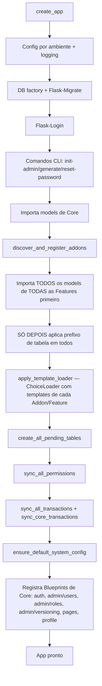
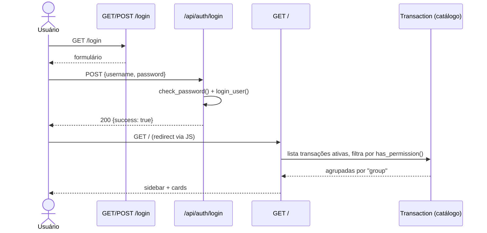
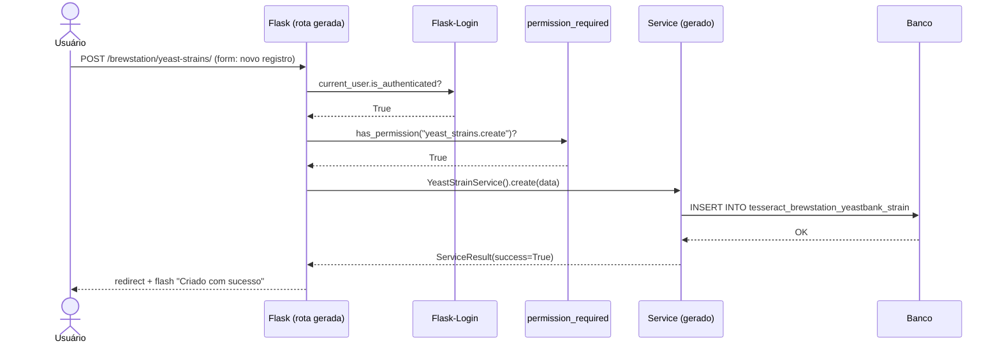
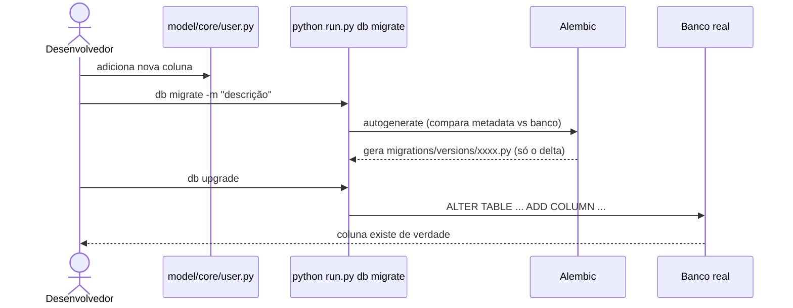
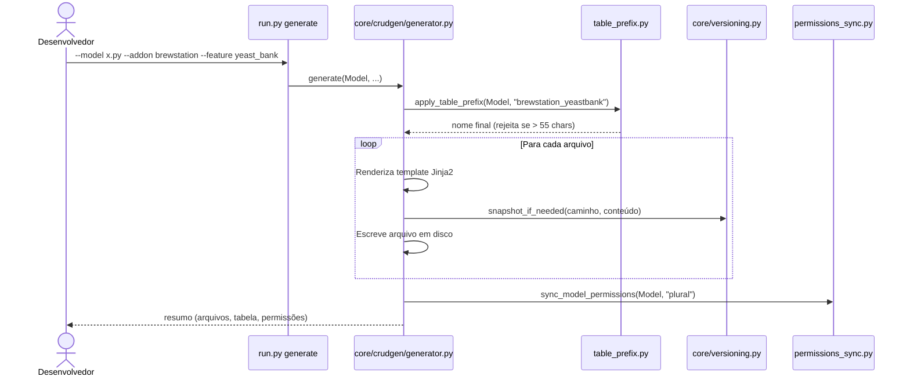

# 03 — Fluxos (Sistema)

## Caminho feliz: boot do app (`create_app()`)

## Sequência: login até a home

## Sequência: requisição autenticada a uma rota gerada pelo CrudGen

## Sequência: alterar coluna de model existente (migration)

## Sequência: `python run.py generate` (CrudGen)

