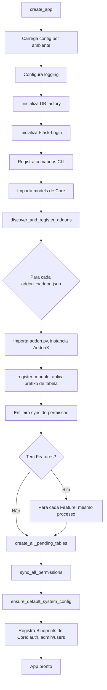
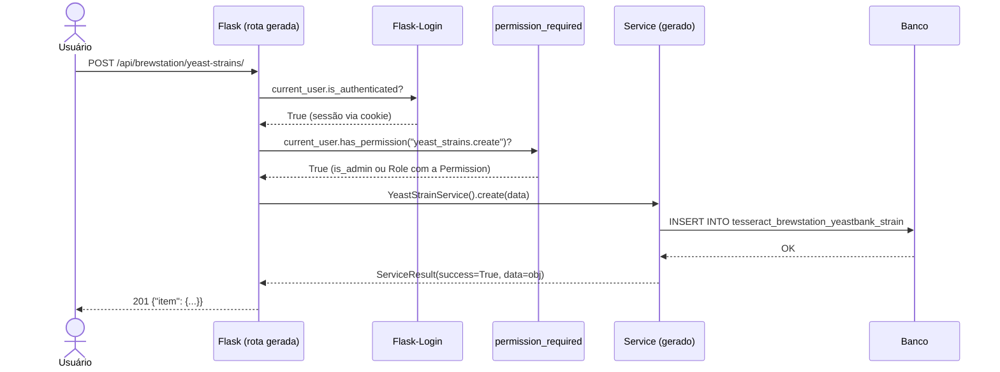
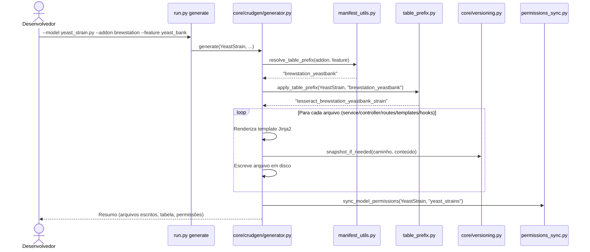

# 03 — Fluxos (Sistema)

## Caminho feliz: boot do app (`create_app()`)

```mermaid
flowchart TD
    A[create_app] --> B[Carrega config por ambiente]
    B --> C[Configura logging]
    C --> D[Inicializa DB factory]
    D --> E[Inicializa Flask-Login]
    E --> F[Registra comandos CLI]
    F --> G[Importa models de Core]
    G --> H[discover_and_register_addons]
    H --> I{Para cada addon_*/addon.json}
    I --> J[Importa addon.py, instancia AddonX]
    J --> K[register_module: aplica prefixo de tabela]
    K --> L[Enfileira sync de permissão]
    L --> M{Tem Features?}
    M -->|Sim| N[Para cada Feature: mesmo processo]
    M -->|Não| O[create_all_pending_tables]
    N --> O
    O --> P[sync_all_permissions]
    P --> Q[ensure_default_system_config]
    Q --> R[Registra Blueprints de Core: auth, admin/users]
    R --> S[App pronto]
```

## Sequência: requisição autenticada a uma rota gerada pelo CrudGen

```mermaid
sequenceDiagram
    actor U as Usuário
    participant F as Flask (rota gerada)
    participant L as Flask-Login
    participant P as permission_required
    participant S as Service (gerado)
    participant DB as Banco

    U->>F: POST /api/brewstation/yeast-strains/
    F->>L: current_user.is_authenticated?
    L-->>F: True (sessão via cookie)
    F->>P: current_user.has_permission("yeast_strains.create")?
    P-->>F: True (is_admin ou Role com a Permission)
    F->>S: YeastStrainService().create(data)
    S->>DB: INSERT INTO tesseract_brewstation_yeastbank_strain
    DB-->>S: OK
    S-->>F: ServiceResult(success=True, data=obj)
    F-->>U: 201 {"item": {...}}
```

## Sequência: `python run.py generate` (CrudGen)

```mermaid
sequenceDiagram
    actor Dev as Desenvolvedor
    participant CLI as run.py generate
    participant Gen as core/crudgen/generator.py
    participant Man as manifest_utils.py
    participant TP as table_prefix.py
    participant Ver as core/versioning.py
    participant Perm as permissions_sync.py

    Dev->>CLI: --model yeast_strain.py --addon brewstation --feature yeast_bank
    CLI->>Gen: generate(YeastStrain, ...)
    Gen->>Man: resolve_table_prefix(addon, feature)
    Man-->>Gen: "brewstation_yeastbank"
    Gen->>TP: apply_table_prefix(YeastStrain, "brewstation_yeastbank")
    TP-->>Gen: "tesseract_brewstation_yeastbank_strain"
    loop Para cada arquivo (service/controller/routes/templates/hooks)
        Gen->>Gen: Renderiza template Jinja2
        Gen->>Ver: snapshot_if_needed(caminho, conteúdo)
        Gen->>Gen: Escreve arquivo em disco
    end
    Gen->>Perm: sync_model_permissions(YeastStrain, "yeast_strains")
    Gen-->>Dev: Resumo (arquivos escritos, tabela, permissões)
```
