# 03 — Fluxos (Sistema)

## Caminho feliz: boot do app (`create_app()`)

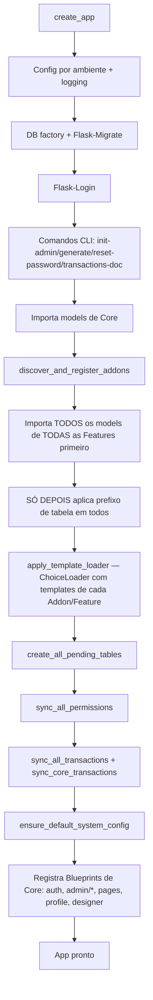
```mermaid
flowchart TD
    A[create_app] --> B[Config por ambiente + logging]
    B --> C[DB factory + Flask-Migrate]
    C --> D[Flask-Login]
    D --> E[Comandos CLI: init-admin/generate/reset-password/transactions-doc]
    E --> F[Importa models de Core]
    F --> G[discover_and_register_addons]
    G --> H[Importa TODOS os models de TODAS as Features primeiro]
    H --> I[SÓ DEPOIS aplica prefixo de tabela em todos]
    I --> J[apply_template_loader — ChoiceLoader com templates de cada Addon/Feature]
    J --> K[create_all_pending_tables]
    K --> L[sync_all_permissions]
    L --> M[sync_all_transactions + sync_core_transactions]
    M --> N[ensure_default_system_config]
    N --> O[Registra Blueprints de Core: auth, admin/*, pages, profile, designer]
    O --> P[App pronto]
```

## Sequência: login até a home

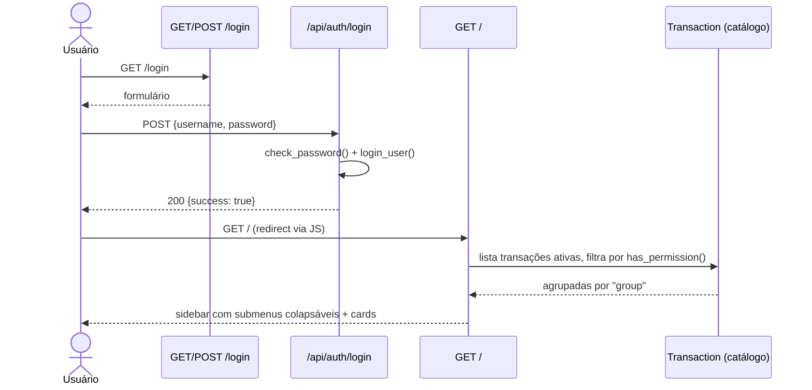
```mermaid
sequenceDiagram
    actor U as Usuário
    participant Login as GET/POST /login
    participant Auth as /api/auth/login
    participant Home as GET /
    participant TX as Transaction (catálogo)

    U->>Login: GET /login
    Login-->>U: formulário
    U->>Auth: POST {username, password}
    Auth->>Auth: check_password() + login_user()
    Auth-->>U: 200 {success: true}
    U->>Home: GET / (redirect via JS)
    Home->>TX: lista transações ativas, filtra por has_permission()
    TX-->>Home: agrupadas por "group"
    Home-->>U: sidebar com submenus colapsáveis + cards
```

## Sequência: requisição autenticada a uma rota gerada pelo CrudGen

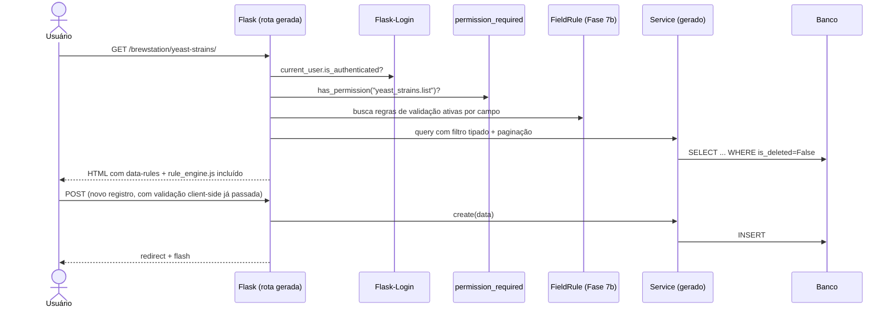
```mermaid
sequenceDiagram
    actor U as Usuário
    participant F as Flask (rota gerada)
    participant L as Flask-Login
    participant P as permission_required
    participant FR as FieldRule (Fase 7b)
    participant S as Service (gerado)
    participant DB as Banco

    U->>F: GET /brewstation/yeast-strains/
    F->>L: current_user.is_authenticated?
    F->>P: has_permission("yeast_strains.list")?
    F->>FR: busca regras de validação ativas por campo
    F->>S: query com filtro tipado + paginação
    S->>DB: SELECT ... WHERE is_deleted=False
    F-->>U: HTML com data-rules + rule_engine.js incluído
    U->>F: POST (novo registro, com validação client-side já passada)
    F->>S: create(data)
    S->>DB: INSERT
    F-->>U: redirect + flash
```

## Sequência: anexar regra de validação e ver ela funcionar (Fase 7b)

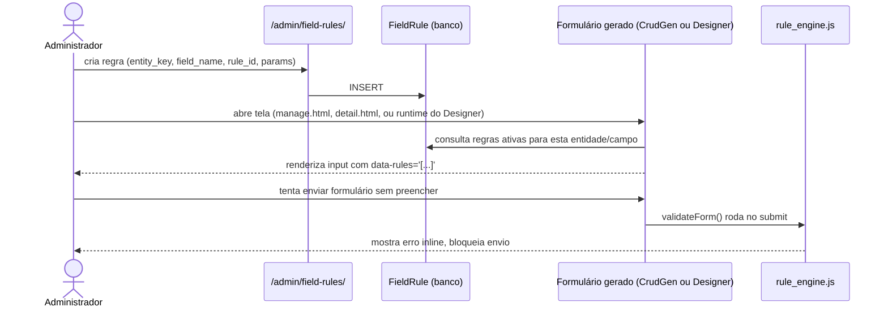
```mermaid
sequenceDiagram
    actor Admin as Administrador
    participant FRUI as /admin/field-rules/
    participant FR as FieldRule (banco)
    participant Form as Formulário gerado (CrudGen ou Designer)
    participant RE as rule_engine.js

    Admin->>FRUI: cria regra (entity_key, field_name, rule_id, params)
    FRUI->>FR: INSERT
    Admin->>Form: abre tela (manage.html, detail.html, ou runtime do Designer)
    Form->>FR: consulta regras ativas para esta entidade/campo
    Form-->>Admin: renderiza input com data-rules='[...]'
    Admin->>Form: tenta enviar formulário sem preencher
    Form->>RE: validateForm() roda no submit
    RE-->>Admin: mostra erro inline, bloqueia envio
```

## Sequência: criar e publicar uma página customizada (Fase 12)

> Substitui a sequência de "montar no canvas" da Fase 7c — o construtor
> visual foi removido; ver skill 16, cabeçalho, para o porquê.

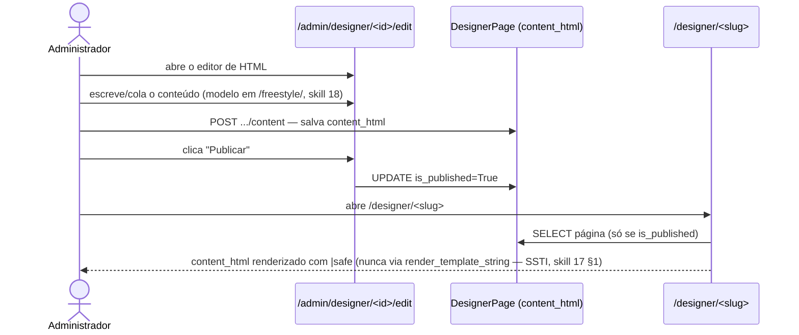
```mermaid
sequenceDiagram
    actor Admin as Administrador
    participant Editor as /admin/designer/<id>/edit
    participant DB as DesignerPage (content_html)
    participant Runtime as /designer/<slug>

    Admin->>Editor: abre o editor de HTML
    Admin->>Editor: escreve/cola o conteúdo (modelo em /freestyle/, skill 18)
    Admin->>DB: POST .../content — salva content_html
    Admin->>Editor: clica "Publicar"
    Editor->>DB: UPDATE is_published=True
    Admin->>Runtime: abre /designer/<slug>
    Runtime->>DB: SELECT página (só se is_published)
    Runtime-->>Admin: content_html renderizado com |safe (nunca via render_template_string — SSTI, skill 17 §1)
```

## Sequência: consumir dado numa página customizada (Fase 10, skill 17)

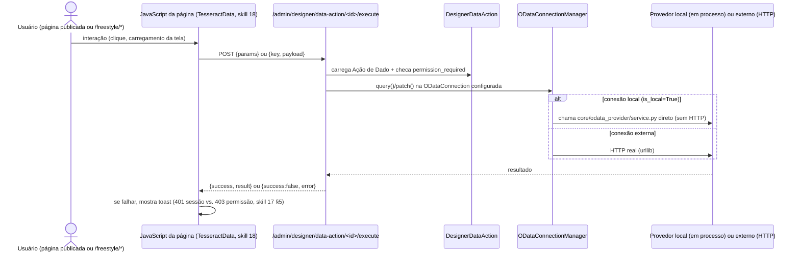
```mermaid
sequenceDiagram
    actor User as Usuário (página publicada ou /freestyle/*)
    participant JS as JavaScript da página (TesseractData, skill 18)
    participant Server as /admin/designer/data-action/<id>/execute
    participant DA as DesignerDataAction
    participant Mgr as ODataConnectionManager
    participant Data as Provedor local (em processo) ou externo (HTTP)

    User->>JS: interação (clique, carregamento da tela)
    JS->>Server: POST {params} ou {key, payload}
    Server->>DA: carrega Ação de Dado + checa permission_required
    Server->>Mgr: query()/patch() na ODataConnection configurada
    alt conexão local (is_local=True)
        Mgr->>Data: chama core/odata_provider/service.py direto (sem HTTP)
    else conexão externa
        Mgr->>Data: HTTP real (urllib)
    end
    Data-->>Server: resultado
    Server-->>JS: {success, result} ou {success:false, error}
    JS->>JS: se falhar, mostra toast (401 sessão vs. 403 permissão, skill 17 §5)
```

## Sequência: substituição de tela CrudGen no menu (Fase 10)

```mermaid
sequenceDiagram
    actor Admin as Administrador
    participant Editor as /admin/designer/<id>/edit
    participant Settings as POST .../settings ou .../publish
    participant Resolver as designer_menu_override.py
    participant TX as Transaction (menu)
    actor End as Usuário final

    Admin->>Editor: preenche replaces_entity_key/replaces_view=manage
    Admin->>Settings: marca "Substituir no menu" + Salvar/Publicar
    Settings->>Resolver: resolve_designer_page_menu_overrides()
    Resolver->>TX: resync completo (código lidera, banco segue)
    Resolver->>TX: acha Transaction com permission_required="<entity_key>.list"
    Resolver->>TX: UPDATE route = "/designer/<slug>"
    End->>TX: clica no item de menu
    TX-->>End: leva pra /designer/<slug> (a DesignerPage)
    Note over End,TX: a rota original do CrudGen (ex. /brewstation/yeast-strains)<br/>continua registrada — acessível direto pra debug, só sumiu do menu
```

## Sequência: navegar dados de um servidor OData externo (Fase 8)

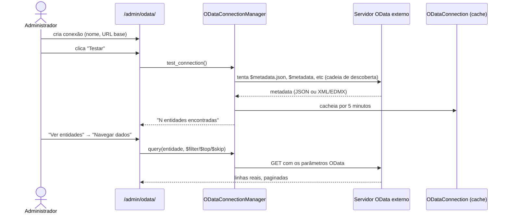
```mermaid
sequenceDiagram
    actor Admin as Administrador
    participant UI as /admin/odata/
    participant Mgr as ODataConnectionManager
    participant Ext as Servidor OData externo
    participant DB as ODataConnection (cache)

    Admin->>UI: cria conexão (nome, URL base)
    Admin->>UI: clica "Testar"
    UI->>Mgr: test_connection()
    Mgr->>Ext: tenta $metadata.json, $metadata, etc (cadeia de descoberta)
    Ext-->>Mgr: metadata (JSON ou XML/EDMX)
    Mgr->>DB: cacheia por 5 minutos
    Mgr-->>UI: "N entidades encontradas"
    Admin->>UI: "Ver entidades" → "Navegar dados"
    UI->>Mgr: query(entidade, $filter/$top/$skip)
    Mgr->>Ext: GET com os parâmetros OData
    Ext-->>UI: linhas reais, paginadas
```

## Sequência: alterar coluna de model existente (migration)

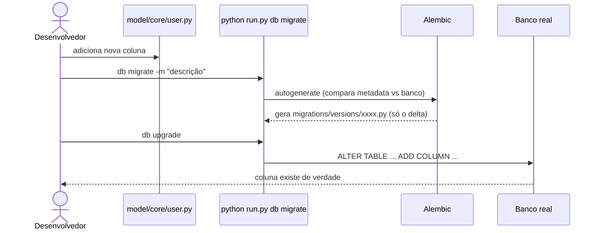
```mermaid
sequenceDiagram
    actor Dev as Desenvolvedor
    participant Model as model/core/user.py
    participant CLI as python run.py db migrate
    participant Alembic as Alembic
    participant DB as Banco real

    Dev->>Model: adiciona nova coluna
    Dev->>CLI: db migrate -m "descrição"
    CLI->>Alembic: autogenerate (compara metadata vs banco)
    Alembic-->>CLI: gera migrations/versions/xxxx.py (só o delta)
    Dev->>CLI: db upgrade
    CLI->>DB: ALTER TABLE ... ADD COLUMN ...
    DB-->>Dev: coluna existe de verdade
```

## Sequência: `python run.py generate` (CrudGen)

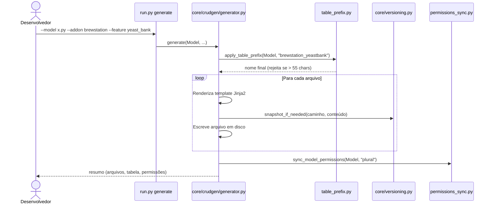
```mermaid
sequenceDiagram
    actor Dev as Desenvolvedor
    participant CLI as run.py generate
    participant Gen as core/crudgen/generator.py
    participant TP as table_prefix.py
    participant Ver as core/versioning.py
    participant Perm as permissions_sync.py

    Dev->>CLI: --model x.py --addon brewstation --feature yeast_bank
    CLI->>Gen: generate(Model, ...)
    Gen->>TP: apply_table_prefix(Model, "brewstation_yeastbank")
    TP-->>Gen: nome final (rejeita se > 55 chars)
    loop Para cada arquivo
        Gen->>Gen: Renderiza template Jinja2
        Gen->>Ver: snapshot_if_needed(caminho, conteúdo)
        Gen->>Gen: Escreve arquivo em disco
    end
    Gen->>Perm: sync_model_permissions(Model, "plural")
    Gen-->>Dev: resumo (arquivos, tabela, permissões)
```

## Sequência: criar Model via Model Builder, revisar e gerar tabela

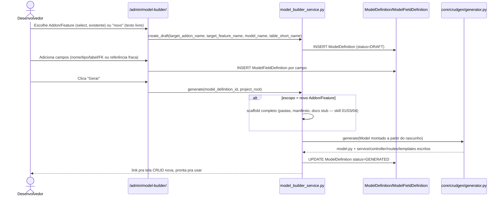
```mermaid
sequenceDiagram
    actor Dev as Desenvolvedor
    participant UI as /admin/model-builder/
    participant Svc as model_builder_service.py
    participant DB as ModelDefinition/ModelFieldDefinition
    participant Gen as core/crudgen/generator.py

    Dev->>UI: Escolhe Addon/Feature (select, existente) ou "novo" (texto livre)
    UI->>Svc: create_draft(target_addon_name, target_feature_name, model_name, table_short_name)
    Svc->>DB: INSERT ModelDefinition (status=DRAFT)
    Dev->>UI: Adiciona campos (nome/tipo/label/FK ou referência fraca)
    UI->>DB: INSERT ModelFieldDefinition por campo
    Dev->>UI: Clica "Gerar"
    UI->>Svc: generate(model_definition_id, project_root)
    alt escopo = novo Addon/Feature
        Svc->>Svc: scaffold completo (pastas, manifesto, docs stub — skill 01/03/04)
    end
    Svc->>Gen: generate(Model montado a partir do rascunho)
    Gen-->>Svc: model.py + service/controller/routes/templates escritos
    Svc->>DB: UPDATE ModelDefinition status=GENERATED
    Svc-->>Dev: link pra tela CRUD nova, pronta pra usar
```

## Sequência: Playground HTTP com Auth/Params/cookie jar (v2)

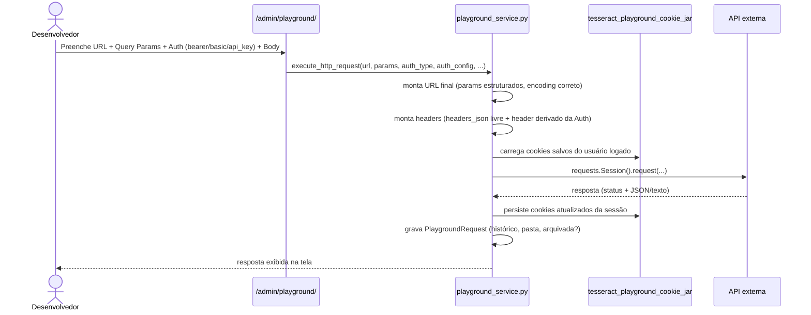
```mermaid
sequenceDiagram
    actor Dev as Desenvolvedor
    participant UI as /admin/playground/
    participant Svc as playground_service.py
    participant Jar as tesseract_playground_cookie_jar
    participant Ext as API externa

    Dev->>UI: Preenche URL + Query Params + Auth (bearer/basic/api_key) + Body
    UI->>Svc: execute_http_request(url, params, auth_type, auth_config, ...)
    Svc->>Svc: monta URL final (params estruturados, encoding correto)
    Svc->>Svc: monta headers (headers_json livre + header derivado da Auth)
    Svc->>Jar: carrega cookies salvos do usuário logado
    Svc->>Ext: requests.Session().request(...)
    Ext-->>Svc: resposta (status + JSON/texto)
    Svc->>Jar: persiste cookies atualizados da sessão
    Svc->>Svc: grava PlaygroundRequest (histórico, pasta, arquivada?)
    Svc-->>Dev: resposta exibida na tela
```

## Sequência: bridge Playground → Model Builder ("usar resposta como base de campos")

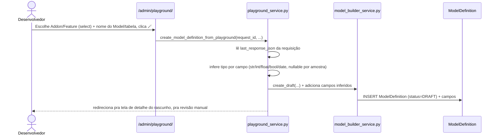
```mermaid
sequenceDiagram
    actor Dev as Desenvolvedor
    participant UI as /admin/playground/
    participant Svc as playground_service.py
    participant MB as model_builder_service.py
    participant DB as ModelDefinition

    Dev->>UI: Escolhe Addon/Feature (select) + nome do Model/tabela, clica 🪄
    UI->>Svc: create_model_definition_from_playground(request_id, ...)
    Svc->>Svc: lê last_response_json da requisição
    Svc->>Svc: infere tipo por campo (str/int/float/bool/date, nullable por amostra)
    Svc->>MB: create_draft(...) + adiciona campos inferidos
    MB->>DB: INSERT ModelDefinition (status=DRAFT) + campos
    Svc-->>Dev: redireciona pra tela de detalhe do rascunho, pra revisão manual
```

## Sequência: menu hierárquico — resolução de ordem/colapso/ícone

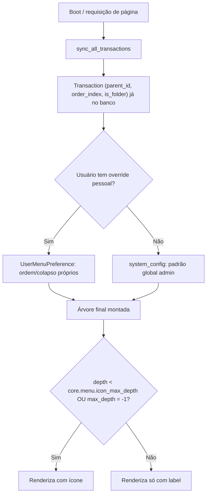
```mermaid
flowchart TD
    A[Boot / requisição de página] --> B[sync_all_transactions]
    B --> C["Transaction (parent_id, order_index, is_folder) já no banco"]
    C --> D{Usuário tem override pessoal?}
    D -- Sim --> E[UserMenuPreference: ordem/colapso próprios]
    D -- Não --> F[system_config: padrão global admin]
    E --> G[Árvore final montada]
    F --> G
    G --> H{depth < core.menu.icon_max_depth OU max_depth = -1?}
    H -- Sim --> I[Renderiza com ícone]
    H -- Não --> J[Renderiza só com label]
```

## Sequência: dispositivo IoT — leitura de sensor até o EventBus (device_manager)

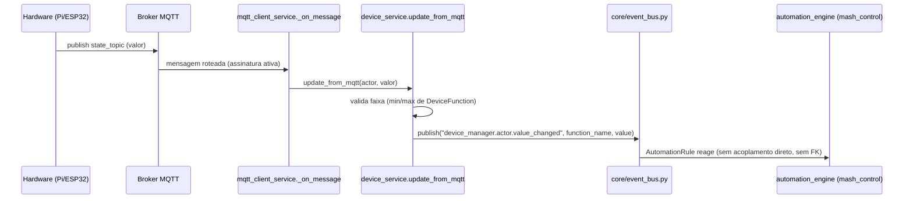
```mermaid
sequenceDiagram
    participant HW as Hardware (Pi/ESP32)
    participant Broker as Broker MQTT
    participant MQTT as mqtt_client_service._on_message
    participant Svc as device_service.update_from_mqtt
    participant Bus as core/event_bus.py
    participant Auto as automation_engine (mash_control)

    HW->>Broker: publish state_topic (valor)
    Broker->>MQTT: mensagem roteada (assinatura ativa)
    MQTT->>Svc: update_from_mqtt(actor, valor)
    Svc->>Svc: valida faixa (min/max de DeviceFunction)
    Svc->>Bus: publish("device_manager.actor.value_changed", function_name, value)
    Bus->>Auto: AutomationRule reage (sem acoplamento direto, sem FK)
```
