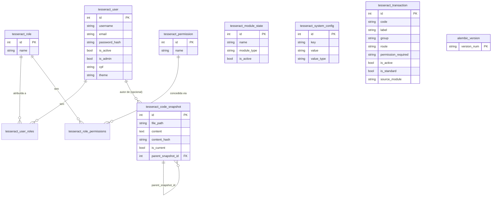

# 04 — Modelo de Dados (Sistema — tabelas de Core)

> Cobre as tabelas de **Core**. O ER completo de cada domínio vive no
> próprio Addon/Feature:
> - `addons/addon_brewstation/features/feature_yeast_bank/docs/technical/04-modelo-de-dados.md` (8 tabelas)
> - `addons/addon_brewstation/features/feature_device_manager/docs/technical/04-modelo-de-dados.md` (4 tabelas)
> - `addons/addon_brewstation/features/feature_mash_control/docs/technical/04-modelo-de-dados.md` (12 tabelas)

## Tabelas e colunas não óbvias

| Tabela | Coluna | Descrição de negócio |
|---|---|---|
| `tesseract_user` | `is_admin` | Bypassa toda checagem de `has_permission()` |
| `tesseract_user` | `theme` | `"light"`/`"dark"` — preferência de UI por usuário |
| `tesseract_code_snapshot` | `is_current` | Só a versão marcada como atual aparece como "estado hoje" |
| `tesseract_code_snapshot` | `generation_run_id` | Agrupa N arquivos escritos numa mesma execução de `generate()` |
| `tesseract_transaction` | `is_standard` | `True` = catálogo de Core (`TX_*`); `False` = contribuída por Addon/Feature |
| `tesseract_transaction` | `permission_required` | Nome de Permission real — nunca um tier separado |
| `alembic_version` | `version_num` | Controlada pelo Flask-Migrate — nunca editar manualmente |

## Regra de soft-delete

Todas as tabelas de domínio (Addon/Feature) seguem `is_deleted`/
`deleted_at` (skill 02). Tabelas de Core (`tesseract_user`,
`tesseract_role` etc.) não têm soft-delete — usam `is_active` (User)
ou são removidas de fato quando vazias de referência (Role).

## Migrations

`db.create_all()` cria tabela nova (Addon/Feature recém-instalado).
**Nunca altera coluna de tabela já existente** — isso é
responsabilidade do Flask-Migrate (`python run.py db migrate && db
upgrade`). Ver `migrations/` na raiz do projeto.
