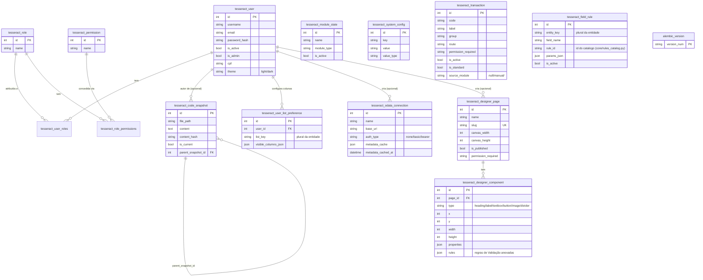

# 04 — Modelo de Dados (Sistema — tabelas de Core)

> Cobre as tabelas de **Core**. O ER completo de cada domínio vive no
> próprio Addon/Feature:
> - `addons/addon_brewstation/features/feature_yeast_bank/docs/technical/04-modelo-de-dados.md` (8 tabelas)
> - `addons/addon_brewstation/features/feature_device_manager/docs/technical/04-modelo-de-dados.md` (4 tabelas)
> - `addons/addon_brewstation/features/feature_mash_control/docs/technical/04-modelo-de-dados.md` (12 tabelas)

## Tabelas e colunas não óbvias

| Tabela | Coluna | Descrição de negócio |
|---|---|---|
| `tesseract_user` | `is_admin` | Bypassa toda checagem de `has_permission()` |
| `tesseract_user` | `theme` | `"light"`/`"dark"` — preferência de UI por usuário |
| `tesseract_code_snapshot` | `is_current` | Só a versão marcada como atual aparece como "estado hoje" |
| `tesseract_code_snapshot` | `generation_run_id` | Agrupa N arquivos escritos numa mesma execução de `generate()` |
| `tesseract_transaction` | `is_standard` | `True` = catálogo de Core (`TX_*`); `False` = contribuída por Addon/Feature ou manual |
| `tesseract_transaction` | `source_module` | `None`/`"manual"` (criada pela tela) ou nome do Addon (ex.: `"brewstation"`) — define se a tela de edição completa é segura (`source_module="manual"`) ou só `is_active` (qualquer outro valor) |
| `tesseract_user_list_preference` | `list_key` | String, não FK — Core não referencia tabela de domínio |
| `tesseract_field_rule` | `entity_key`/`field_name` | Strings, não FK — mesma razão. `rule_id` referencia `core/rules_catalog.py`, não outra tabela |
| `tesseract_odata_connection` | `metadata_cache` | Cache de 5 minutos da descoberta de `$metadata` — evita bater no servidor externo a cada navegação |
| `tesseract_designer_component` | `rules` | JSON — onde uma regra do `tesseract_field_rule`-like catalog é referenciada por `js_function`, consumida pelo `rule_engine.js` no runtime |
| `alembic_version` | `version_num` | Controlada pelo Flask-Migrate — nunca editar manualmente |

## Regra de soft-delete

Todas as tabelas de domínio (Addon/Feature) seguem `is_deleted`/
`deleted_at` (skill 02). Tabelas de Core (`tesseract_user`,
`tesseract_role`, `tesseract_designer_page` etc.) não têm
soft-delete — usam `is_active` (User) ou exclusão de fato quando vazias
de referência (Role), ou simplesmente não precisam (Designer/OData
são configuração de admin, não dado de domínio auditável).

## Migrations

`db.create_all()` cria tabela nova (Addon/Feature recém-instalado, ou
qualquer tabela de Core nova como `tesseract_designer_page`).
**Nunca altera coluna de tabela já existente** — isso é
responsabilidade do Flask-Migrate (`python run.py db migrate && db
upgrade`). Ver `migrations/` na raiz do projeto.
