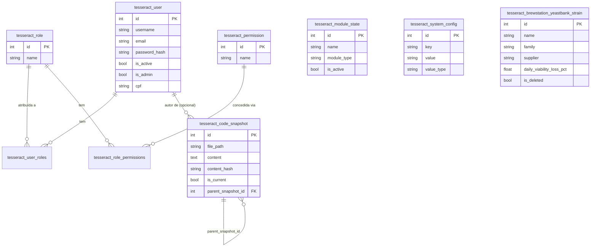

# 04 — Modelo de Dados (Sistema — tabelas de Core + o que existe hoje)

> Cobre só as tabelas de **Core** e a única tabela de domínio existente
> até a Fase 5 (`tesseract_brewstation_yeastbank_strain`). O ER completo
> de `yeast_bank` (8 tabelas) entra no
> `addons/addon_brewstation/features/feature_yeast_bank/docs/technical/04-modelo-de-dados.md`
> quando a Fase 5b portar o restante.

## Tabelas e colunas não óbvias

| Tabela | Coluna | Descrição de negócio |
|---|---|---|
| `tesseract_user` | `is_admin` | Bypassa toda checagem de `has_permission()` — acesso total |
| `tesseract_code_snapshot` | `is_current` | Só a versão marcada como atual aparece em consultas de "estado hoje" — histórico fica com `is_current=False` |
| `tesseract_code_snapshot` | `generation_run_id` | Agrupa N arquivos escritos numa mesma execução de `generate()` |
| `tesseract_brewstation_yeastbank_strain` | `viability_model` | Nome do algoritmo de decaimento de viabilidade (hoje só `linear_decay_default` é usado; o cálculo em si ainda não foi portado) |

## Regra de soft-delete

`tesseract_brewstation_yeastbank_strain` segue o padrão `is_deleted`/
`deleted_at` da skill 02 — `trash`/`restore` alternam a flag,
`delete_permanent` remove a linha de fato (e só é permitido quando
`is_deleted=True`).
