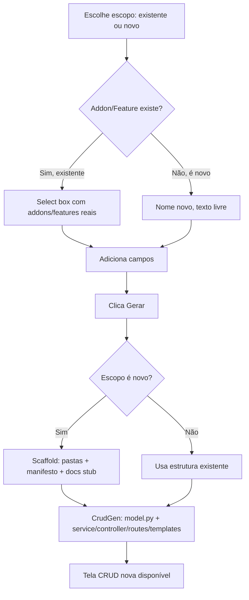

# 05 — Casos de Uso (Sistema)

## UC01 — Administrador cria o primeiro usuário admin

- **Ator**: Administrador (linha de comando, banco vazio)
- **Fluxo principal**: `python run.py init-admin --username admin --password ...`
- **Fluxo alternativo**: usuário já existe → comando avisa e não duplica
- **Permissão**: nenhuma (fora da API)

## UC02 — Usuário recupera acesso perdido

- **Ator**: Administrador (via CLI) ou o próprio admin (via tela, pra
  outro usuário)
- **Fluxo principal (CLI)**: `python run.py reset-password --username X --password Y [--reactivate]`
- **Fluxo principal (tela)**: `/admin/users/<id>` → "Redefinir senha"
- **Fluxo alternativo**: autodesativação — bloqueada explicitamente na
  tela, mas possível via API (efeito: sessão desautentica)
- **Permissão**: `admin`

## UC03 — Desenvolvedor gera CRUD a partir de um model anotado

- **Ator**: Desenvolvedor
- **Fluxo principal**: `python run.py generate --model ... --addon ... [--feature ...]`
- **Fluxo alternativo**: arquivo já existe sem `--overwrite` → preservado
  (hooks sempre preservados, mesmo com `--overwrite`)
- **Permissão**: nenhuma (CLI)

## UC04 — Desenvolvedor altera coluna de um model já existente

- **Ator**: Desenvolvedor
- **Pré-condição**: tabela já existe no banco (`db.create_all()` não
  resolve este caso)
- **Fluxo principal**: editar o model → `python run.py db migrate -m "..."` → `python run.py db upgrade`
- **Permissão**: nenhuma (CLI)

## UC05 — Usuário com permissão cria/edita/exclui um registro (CRUD genérico)

- **Ator**: Usuário autenticado com a Permission correspondente
- **Fluxo principal**: tela de listagem → "+" expande formulário →
  criar (validado client-side se houver `FieldRule`) → editar no
  detalhe → lixeira → restaurar → excluir permanente (só se já estiver
  na lixeira)
- **Fluxo alternativo — sem permissão**: 403
- **Fluxo alternativo — não autenticado**: redireciona pra `/login`
- **Permissão**: `<plural>.<ação>`

## UC06 — Administrador cria um Role e associa Permissions

- **Ator**: Administrador
- **Fluxo principal**: `/admin/roles/` → criar Role → `/admin/roles/<id>`
  → marcar Permissions agrupadas por módulo → salvar
- **Fluxo alternativo**: excluir Role com usuário atribuído → bloqueado
- **Permissão**: `admin`

## UC07 — Administrador investiga/restaura uma versão de arquivo gerado

- **Ator**: Administrador
- **Fluxo principal**: `/admin/versioning/` → busca arquivo → histórico
  → seleciona duas versões → diff → restaurar (grava no disco + novo
  snapshot `origin=RESTORE`)
- **Permissão**: `admin`

## UC08 — Usuário troca o próprio tema (claro/escuro)

- **Ator**: qualquer usuário autenticado
- **Fluxo principal**: menu do usuário ou `/perfil/` → alternar tema →
  `POST /api/auth/update-theme` → persiste por usuário
- **Permissão**: nenhuma (próprio usuário)

## UC09 — Administrador anexa uma regra de validação a um campo

- **Ator**: Administrador
- **Fluxo principal**: `/admin/field-rules/` → escolhe entidade
  (`entity_key`), campo, regra do catálogo (grupo Validação) e
  parâmetros JSON → salva
- **Resultado**: o campo correspondente, em qualquer tela gerada pelo
  CrudGen *ou* num `textbox` do Designer, passa a validar no client
  antes do envio
- **Permissão**: `admin`

## UC10 — Administrador monta uma página visual no Designer

- **Ator**: Administrador
- **Fluxo principal**: `/admin/designer/` → criar página → editor
  (arrastar componente da paleta, posicionar, redimensionar, editar
  propriedades) → publicar → acessar em `/designer/<slug>`
- **Fluxo alternativo**: tentar acessar página não publicada → 404;
  acessar com `permission_required` definido sem ter a permissão → 403
- **Permissão**: `admin` para editar; a definida em
  `permission_required` (ou nenhuma) para visitar a página publicada

## UC11 — Administrador conecta a um servidor OData externo

- **Ator**: Administrador
- **Fluxo principal**: `/admin/odata/` → criar conexão (nome, URL,
  autenticação opcional) → testar (descobre `$metadata`) → ver
  entidades → navegar dados (read-only, com busca e paginação)
- **Fluxo alternativo**: URL inválida ou servidor fora do ar → mensagem
  de erro com a lista de URLs de metadata tentadas
- **Permissão**: `admin`

## UC12 — Administrador cria uma transação manual no menu

- **Ator**: Administrador
- **Fluxo principal**: `/admin/transactions/` → "Nova transação
  manual" → código, label, rota, grupo, ícone, permissão opcional
- **Fluxo alternativo**: tentar editar campos de uma transação vinda
  do código → bloqueado (a edição se perderia no próximo boot); só
  `is_active` é editável nesse caso
- **Permissão**: `admin`

## UC13 — Desenvolvedor cria um Model novo pelo Model Builder Visual

- **Ator**: Desenvolvedor
- **Fluxo principal**: `/admin/model-builder/` → escolhe escopo
  (Addon/Feature já existente, via select; ou novo, texto livre) →
  adiciona campos um a um → "Gerar" → CrudGen roda o pipeline completo
  → tela CRUD nova disponível
- **Fluxo alternativo**: gerar sem nenhum campo → bloqueado; gerar de
  novo sem `--overwrite` equivalente → bloqueado, evita sobrescrever
  customização
- **Permissão**: `model_definitions.view` (tela) + `admin` (ação de gerar)

## UC14 — Desenvolvedor testa uma API externa e vira Model a partir da resposta

- **Ator**: Desenvolvedor
- **Fluxo principal**: `/admin/playground/` → monta requisição (URL,
  método, Auth — bearer/basic/api_key, Query Params, Headers/Body
  livres) → executa → vê resposta → clica na varinha mágica → escolhe
  Addon/Feature (select) + nome do Model/tabela → cria rascunho no
  Model Builder → revisa campos inferidos → gera
- **Fluxo alternativo**: login numa API externa que devolve cookie de
  sessão → próxima chamada do mesmo usuário já reaproveita o cookie
  automaticamente (cookie jar por usuário)
- **Permissão**: `playground_requests.execute`

## UC15 — Desenvolvedor organiza o histórico do Playground em pastas

- **Ator**: Desenvolvedor
- **Fluxo principal**: cria pasta (com pasta-pai opcional, árvore
  N-níveis) → move requisições existentes pra dentro → arquiva as que
  não usa mais (some da lista, recuperável) → apaga definitivamente
  as descartáveis
- **Fluxo alternativo**: apagar pasta com conteúdo dentro → bloqueado,
  precisa mover ou apagar o conteúdo primeiro
- **Permissão**: `playground_requests.execute`

## UC16 — Administrador reorganiza o menu (ordem, colapso, ícone)

- **Ator**: Administrador
- **Fluxo principal**: `/admin/menu-settings/` → arrasta item pra
  reordenar dentro do mesmo nível → ↑/↓ promove/rebaixa (só exibição)
  → marca pasta como colapsada por padrão → escolhe até que nível
  mostrar ícone → salva
- **Fluxo alternativo**: usuário comum não gosta do padrão global →
  ajusta a própria preferência em `/perfil/menu-preferencias`, sem
  afetar os demais
- **Permissão**: `system_config.menu_settings` (padrão global);
  nenhuma além de estar autenticado (preferência pessoal)

## UC17 — Administrador consulta e limpa logs

- **Ator**: Administrador
- **Fluxo principal**: `/admin/logs/` → escolhe fonte (log global do
  Core, ou log de integração de um Addon específico) → lê conteúdo →
  apaga se necessário (rotação já limita o tamanho sozinha)
- **Fluxo alternativo**: fonte sem arquivo ainda (nunca gerou log) →
  mensagem amigável, não erro
- **Permissão**: `admin`

## UC18 — Administrador agenda um job (task)

- **Ator**: Administrador
- **Fluxo principal**: `/admin/tasks/` → cria task (tipo: chamada
  Python registrada, requisição HTTP, ou SQL) → define agendamento
  (cron ou intervalo) → acompanha histórico de execuções (sucesso/
  falha/duração)
- **Fluxo alternativo**: task marcada `requires_approval` → fica
  `pending_approval` até alguém aprovar explicitamente
- **Permissão**: `admin`

## UC19 — Administrador corrige o nome de rota de uma entidade OData

- **Ator**: Administrador
- **Contexto**: servidor OData cujo metadata não segue o padrão EDMX
  (sem `EntitySet`), então o Tesseract não tem como saber o nome real
  da coleção só pelo nome declarado
- **Fluxo principal**: `/admin/odata/<id>/entities` → tenta navegar →
  se der 404, o sistema já tenta uma pluralização automática sozinho;
  se ainda assim errar, o campo de "nome da rota" ao lado da entidade
  é editável — corrige manualmente, salva, e o Tesseract lembra da
  próxima vez
- **Permissão**: `admin`

## UC20 — Administrador expõe uma entidade do CrudGen para o Designer (Fase 10)

- **Ator**: Desenvolvedor (anotação no código, não é tela)
- **Fluxo principal**: adiciona `@odata_expose("<entity_name>",
  permission_required="<opcional>")` no model → no próximo boot, a
  entidade aparece no metadata de `/api/odata-provider/$metadata.json`
  e pode ser referenciada por uma `DesignerDataAction`
- **Fluxo alternativo**: entidade sem `@odata_expose` → nunca aparece
  no provedor local, mesmo com o Addon ativo (opt-in, decisão
  registrada em BACKLOG.md)
- **Permissão**: n/a (decisão de código, não de runtime)

## UC21 — Desenvolvedor consome uma Ação de Dado numa página customizada (Fase 10/12)

> Reescrito na Fase 12: não existe mais painel "Eventos (onClick)" no
> editor (era do canvas, removido) — a chamada é JavaScript direto na
> página.

- **Ator**: Desenvolvedor (edita `content_html` ou um modelo freestyle)
- **Contexto**: já existe uma `DesignerDataAction` cadastrada (nome,
  conexão, entidade, operação `query`/`update`, permissão opcional)
- **Fluxo principal**: escreve um botão em HTML com `onclick` (ou
  listener via `addEventListener`) chamando `TesseractData.
  acaoDeDado(id, corpo)` (`static/js/freestyle/freestyle-tesseract-
  data.js`, skill 18) → o navegador dispara `POST /admin/designer/
  data-action/<id>/execute` (server-side, nunca expõe credencial de
  conexão) → resultado tratado no `.then()`
- **Fluxo alternativo**: usuário sem a `permission_required` da Ação
  de Dado → resposta `403`; o helper devolve mensagem legível
  (`"Você não tem permissão para esta operação."`) em vez do botão
  travar silenciosamente
- **Permissão**: quem edita a página precisa poder publicar
  (`admin`); a `permission_required` da própria `DesignerDataAction`
  (ou nenhuma) vale para o usuário final que dispara a chamada

## UC22 — Administrador substitui uma tela do CrudGen por uma página do Designer (Fase 10/12)

- **Ator**: Administrador
- **Contexto**: já escreveu (ou colou de `/freestyle/consumption`) uma
  página customizada que exibe/edita, via JavaScript e Ação de Dado,
  o que a tela gerada pelo CrudGen mostrava — **não** é mais um
  `form_container`/`datagrid` de canvas (removidos na Fase 12)
- **Fluxo principal**: editor do Designer → painel "Configurações da
  página" → preenche `replaces_entity_key` (plural da entidade, ex.
  `yeast_strains`) + `replaces_view=manage` → marca "Substituir no
  menu" → Salvar/Publicar → o item de menu daquela entidade passa a
  apontar pra `/designer/<slug>`
- **Fluxo alternativo**: `replaces_entity_key` sem nenhuma
  `Transaction` correspondente (`permission_required` não bate com
  nenhuma) → log de aviso, nada é trocado, sem erro pro usuário;
  desmarcar o checkbox ou despublicar a página restaura o item de
  menu original sozinho, no próximo resolver (boot ou qualquer ação
  de publicar/salvar/apagar página)
- **Permissão**: `admin`. A rota original do CrudGen nunca é removida
  — continua acessível direto (não pelo menu) pra debug/conferência
  de valores, mesmo com a substituição ativa.
